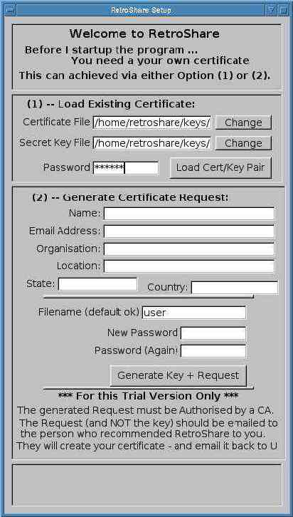
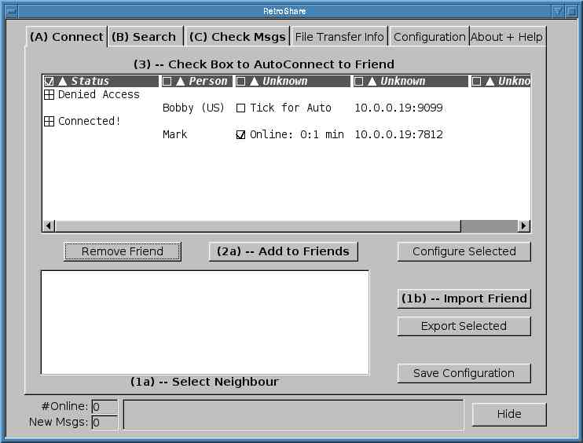
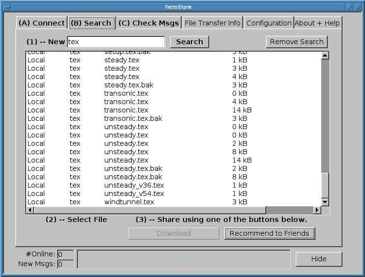
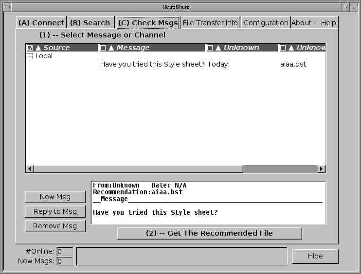
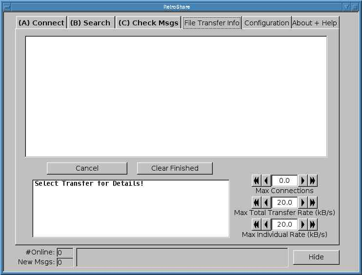
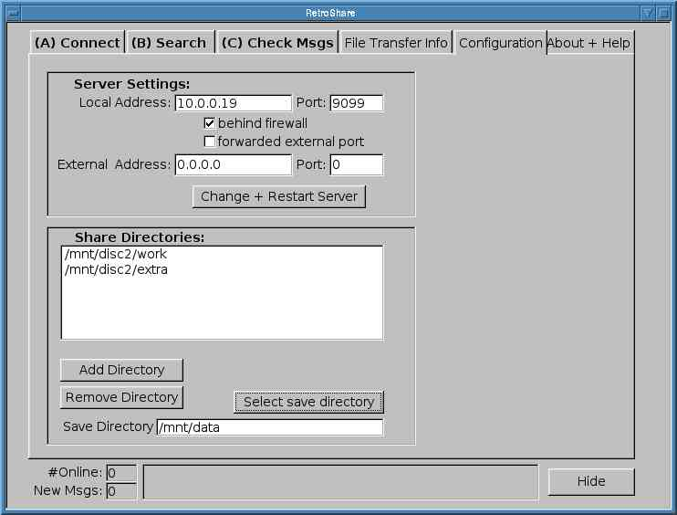
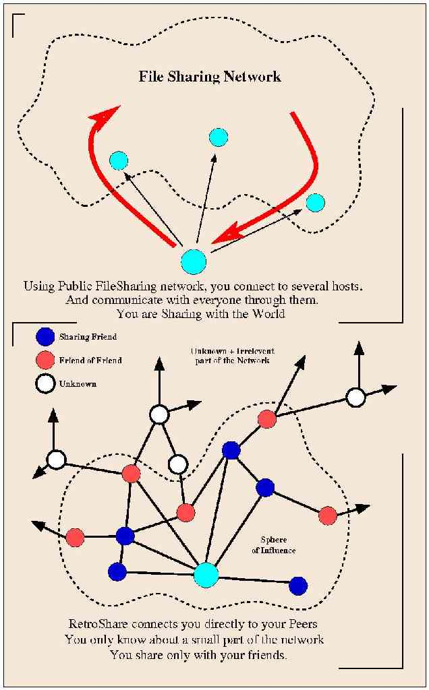

#History of RetroShare 

##2016

##2015
###26th June 2015
 - 0.6.0-rc2
 
###10th June 2015
 - 0.6.0-rc1

##2014
###11th April 2014 	
 - v0.5.5c

##2013
###30th September 2013
 - v0.5.5a

##2012 
###27th September 2012
 - 0.5.4a 	

###9th of February 2012
 - v0.5.3a 
 
##2011 
###13th August 2011
 - v0.5.2a

###13th March 2011
 - v0.5.1a
 
##2010 
###18th April 2010
 - release of RetroShare v0.5.0

###22nd March 2010
 - v0.5.0 alpha 2

###14th February 2010
 - v0.5.0 alpha 1
 
##2009
###28th November 2009
 - retroshare-v0.4.X  

###13th May 2009
 - RetroLocal_0.4.13a

###April 09
Retroshare development is still active, with ever growing numbers 
of developers and users. At this point (April 2009) we've had 
over 50,000 downloads, and are soon to release version v0.4.13. 

##2008
###4th August 2008
 - RetroLocal_0.4.09b  
   Single Directory Install

###8th January 2008
 - retroshare-v0.3.50+

##2007
###19th May 2007
 - retroshare-v0.3.0
 
###12th March 2007
 - Version 0.3.0-pr5 has been placed on the web.
 - This is the first Qt4.0 gui, and is a lot more user friendly than the FLTK gui. This of course came at a cost... lots of hours, and lots of pain trying to get cygwin + retroshare, pthreads, mingw + Qt4.0 all working together. (and 5 times bigger).  
   But its Done!. This is Pre-Release5, alternatively known as rc1. Please test, and report back. 

###12th March 2007
 - V0.3.0-PreRelease7 	

###20th Jan 2007
 - New GUI is functioning... Took a while. But got there in the end. 

##2006
###23rd Nov 2016
 - retroshare-v0.2.1 

###October 2006
 - Crypton joins the team, bringing in beginning of Qt GUI,
   and starting the push towards a new interface. This will a couple of month process, as everything gets bashed around a bit. 

###17th August 2006
Version 0.2.0rc4 has been placed on the web. This version brings the following new features:  
 - First release with Web of Trust Authentication!  
 - Downloads are automatically resumed  
 - New Directory search interface.  

####v0.2.0 Startup

When you first run RetroShare, the Login Window is presented.

 - Existing user: then just enter your password.
 - New User: Follow the instructions below. 

Setting Up a New User

To use RetroShare, you first need to create yourself a Certificate. 
This is done by:

 - Fill in the second half of the form (Only Name and Password are compulsory)
 - Click "Generate Request", and retroShare should start up!. If there is 
 an error, a window will pop-up with instructions on how to fix the problem. 

  

####v0.2 Retroshare Connect Window

This window displays:

 - A List of Trusted People (Top Window)  
 - A List of Friends of Your Friends. (Bottom Window)  

This window allows you to:

 - Monitor the Connection Status of all your friends - displayed in the upper window.
 - Enable/Disable each User's Access via the Check Boxes. 
   The Status Column shows which people are Connected, or Offline. 
 - For more Information/Configuration of a Peer, select their certificate, 
   and the press the "Configure Certificate" Button on the right-hand side.
 - Remove a Person from your Trusted List is done by selecting them 
   from the list, and then clicking on the "Remove Person" Button.  
   They will be moved to the lower, untrusted list.
 - To Add a new Person: Either select their Name in the lower window and 
   then press "Add to Friends", or Add their Certificate, via the Load 
   Certificate Button on the right-hand side. The Certificate will 
   appear in the Trusted Window. Check the AutoConnect button to 
   enabling sharing with them. 

  

####v0.2 Search Window

This allows you to Search the currently connected Peers.
 
 - Enter the phrase in the top field, and press the search button.
 - As the results come back, they are displayed in the window.
 - To Download, Select the file, and press the button. The File Listing 
   will immediately appear in the File Transfer Window.
 - You can Recommend one of your Own Files (the Ones Marked *Local*) 
   to someone by clicking the "Recommend" Button. This brings up a Message Window:
 - Enter Your Message, Select who you want to send it to, and click "Send". 
   The Message will be sent instantly to all those connected, and queued for the others offline. 

  

####v0.2 Message Window

 - The Window displays a list of received massages.
 - It allows you to Send/Reply or Delete Messages via the buttons on 
   the left-hand side.
 - Recommendations can be downloaded by selecting the message, and then 
   pressing the "Download" Button.
 - You Can Also Open the "Universal Chatter Box" from here. 
 
  

####v0.2 File Transfer
This Tab allows you to monitor the current file transfers.

 - Select a Transfer from the Top Window, and the details appear in the Lower Window.
 - Cancel a Selected Transfer, by clicking on "Cancel Transfer"
 - Clear All the Completed Transfers, by clicking on "Clear Finished"

This Tab also allows you to control the Maximum Transfer Rates, 
using the scroll numbers on the left hand side:

 - Set the Maximum Individual Rate for Uploads and Downloads using the the top field. 
 - Set the Total Maximum Data Rate using the scroll number below.
 - The "Maximum Connections", or bottom field, is only eye-candy. 
 
  

####v0.2 Configuration
Using this panel you can configure RetroShare's ports, and its shared directories:

 - If you are directly connected to the Internet (via broadband) 
   then you should have Port Configuration set to auto. Ensure the the 
   Box near the Top is Ticked.
 - If you are behind a Firewall, and have opened a port through it. 
   Then you should set your external address: Tick the "Firewalled", and 
   the "Forwarded" Boxes. Enter your external address, in the field. 
   Then press Change.
 - If you are behind a firewall, and cannot open an external port, Tick 
   the "Firewalled" Box. You can only make outgoing Connections.
 - Add shared directories through the lower panel. 

  

###12th August 2006
 - Ported the UDP Transport layer to Windows. Damn Microsoft make it hard to get the most basic of functionality to work! 

###15th July 2006
 - Finally completed the XPGP web of trust authentication system. Successfully tested it using a modified SSL3/TLS1 connection protocol. 

###21st April 2006
 - First successful NAT hole punching using the new UDP communication layer. 

###15st April 2006
 - Implementation of a SSL BIO layer is completed, and the first successful tests of a SSL connection over the UDP transport layer have been run! 

###06th April 2006
 - Completed initial (Linux Only) implementation of UDP transport layer, 

###27th Feb 2006
 - Basic proxy system implemented to get around firewalls. 

###25th Feb 2006
 - Source Code for v0.1.0 is available under LGPL v2 Licence 

###Jan 2006
The first Windows release of Retroshare has been placed on the web. This version provides:

 - Standard SSL Hierarchical authentication scheme.
 - SSL over TCP connections between peers.
 - AutoDiscovery system to introduce you to others.
 - Shared directories, searchable by your peers.
 - Generic file downloading. 
 
###06th January 2006 
What is RetroShare? and Why another Peer to Peer Network?

RetroShare is the next generation sharing network, which provides:

 - A Private Peer to Peer Network which allows you to share information 
   with only the people you want to.
 - Reliable Identification and Authentication of your friends.
 - Plus an Introduction Scheme which connects you to the friends of your 
   friends, and facilitates network growth.
 - Encrypted Communication, ensuring all shared information is known 
   only to you and your peers.
 - A Communication Platform which can potentially support services such 
   as Secure Email, File Sharing, Video or Voice over IP and Messaging
 - A Decentralised Social Sharing Network designed **For the People**
 - with no dependancies on any corporate system or central servers. 

The problem with existing filesharing networks is that you have no 
control over who you share information with. I don't want to share 
with the whole wide world, but I would love to share stuff with my 
friends. But this is not easy to do, safely and securely, over the Internet.

Current filesharing systems also suffer from bad quality of 
downloadable information. Often the filenames do not correspond 
to what you actualy get. You are getting (potentially random) 
information from a collection of random people. I want to share 
good information with, and only with, the people I trust.

RetroShare is my solution to these problems: A simple filesharing 
program which connects you and your friends together for safe and 
secure sharing.

I have put months of work into transforming RetroShare from a random idea, into a working system. It is now time to share this program, and the ideas behind, with the world...

Dr Bob, 06/01/06
 
 
  
