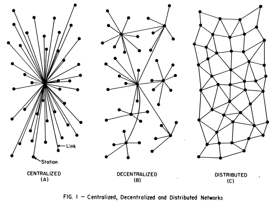
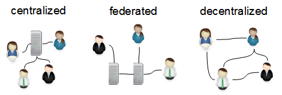
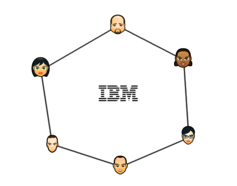
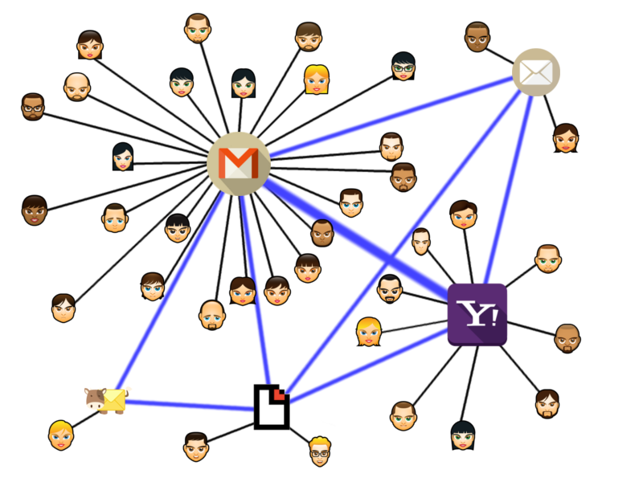
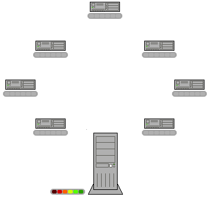
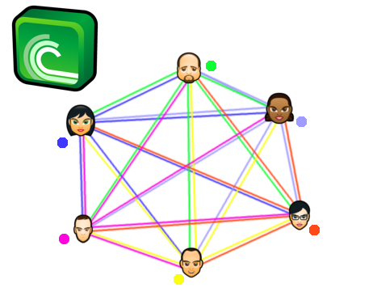
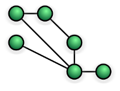
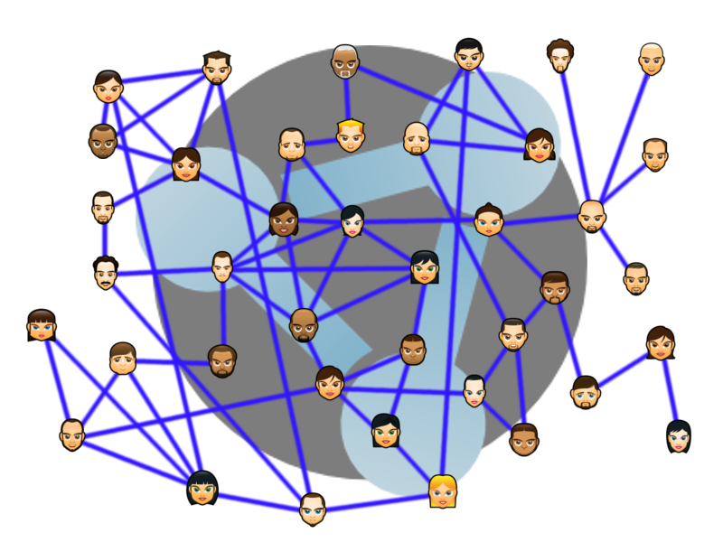

#Topology  
 
RetroShare builds a decentralized, serverless, distributed, peer-to-peer mesh network. 

The meaning of these terms has changed in time and so different 
interpretation are met. 
 
 - decentralized  
 - distributed  
 - serverless  
 - peer to peer  
 - meshed  

Let's explain the different kinds of networks.  

##History of Network Topology's 

The first architecture of computer networks were **client-server architecture** 
and **ring**. 
If the central server is offline, the whole network breaks. 
The military made first thoughts to make the computer network still 
avaiable in the case of a *first strike* of the opponent. 

  
Baran, Paul. [On Distributed Communication Networks](http://www.rand.org/pubs/research_memoranda/RM3420/RM3420-chapter1.html): 
I. Introduction to Distributed Communications Networks. Santa Monica, CA: RAND 
Corporation, 1964. [http://www.rand.org/pubs/research_memoranda/RM3420.html](http://www.rand.org/pubs/research_memoranda/RM3420.html). 
Also available in print form.  

These thoughts have been utilized in the design of the 
[ARPANET](https://en.wikipedia.org/wiki/ARPANET)(1969) which can be seen as a 
predecessor of the modern internet as we know it. 

The description of Paul Baran has evolved since the 60's 

##Modern Network Topology  

Nowadays the definition have shifted from: 

 - *decentralized* -> [federated](../concept/topology/#decentralized-federated-servers)  
 - *distributed* -> [decentralized](/concept/topology/#distributed-decentralized)  
 
  
[GSoC2014 Social Network Plugin for RetroShare](http://blog.freifunk.net/2014/gsoc-social-network-plugin-retroshare)  

##Ring  
  
[Ring Network](https://en.wikipedia.org/wiki/Ring_network)  

IBM introduced [Token-Ring](https://en.wikipedia.org/wiki/Token_ring)(1984) protocol which was the most used 
protocol for this type of network architecture. 

  

Disadvantages of a Ring network.  

 - One malfunctioning workstation can create problems for the entire network.  
 - Moving, adding and changing the devices can affect the network  
 - Communication delay is directly proportional to number of nodes in the network  
 - Bandwidth is shared on all links between devices  
 - More difficult to configure than a Star: node adjunction = Ring shutdown and reconfiguration  

##Centralized -> Client Server  
  
[Centralized Network](https://en.wikipedia.org/wiki/Star_network)  

A star topology with the server in the middle, and clients connected to it. That's an 
efficient way to run a network. Big Corporations run their service also 
in this fashion. Once you register an account with them, you have to stick 
with your data to them. It's not possible to move your account to a 
different provider. Communication is done always inside their network and 
is barely going outside. It's a competitive *the winner takes it all* market 
which tends to monopolization. 

  

The downside of this network is, the central infrastructure is a single 
point of failure. If something happens with the server, all users are affected 
and the service is broken for all. 
Peer Pressure makes it hard to widthstand to not use these services.  
These Services are often free (as in free beer) but include hidden costs. 
User generated data is gathered all the time on each possible way.  
When a third party or the company wants to censor/filter/block parts of 
the communication they can do whenever they want with ease. 
They have the right to do this, because it's their property.  

##Decentralized -> Federated Servers
E-Mail is a decentralized network by design. Everyone can run a Mail 
for it's own purpose. If a single Mail Server is offline for whatever 
reason, the other Mail Server's will still work and send receive mails. 
This **client-to-server-to-server-to-client architectures** is also 
referred as **Federated Network**. 

Besides e-mail, other known Social and Communication Networks with a federated structure 
are Diaspora and XMPP/Jabber. 

Users become a member of a server, and in principle only connect directly 
with their own server; these servers in turn are connected to each other 
to allow users in different server to interact with each other. 
This matches the **distributed network of centralized networks** description 
given above quite well.

In the case of e-mail, we can see, single persons still run their own 
personel mail servers, but most users stick to a few Mail Server Providers. 
This concentration to monopoly's renders the federation in fact useless and feels for the 
majority like a centralized network. The biggest mail provider has a market share 
of ~70% (2015).  
In fact e-Mail is nowadays a totally centralized network with all the 
downsides of centralized networks. 

 

Small Mail Providers had also to shut down in the last years, for example 
the case of Lavabit. They did not comply with the government which ordered 
them to spy on their users. 
Other mail providers do fully comply with the orders and 
hand over the infrastructure as a whole to the surveilance state. 

##Distributed -> Decentralized  

###Torrent  
  
[Fully Connected Network](https://en.wikipedia.org/wiki/Network_topology#Fully_connected_network)  

BitTorrent is well known for it's decentralization. It started with a 
torrent tracker server to keep the torrent files and help the clients to 
connect o each other. So a single server does not share any files in the 
network, but distribute the load of downloads between all clients. Each 
client is doing uploads and downloads. 

  
Torrent Swarm with a central Torrent Tracker.  

This was a single point of failure as the tracker was a centralized service. 
Someone had to operate and pay the server, could be hold liable for 
the Users doing or serving the torrent files. Torrent Files are not 
containing any copyrighted material. Tracker owners have been targeted and 
had to close down the service.  
This made it necessary to evolve BitTorrent into a Trackerless system. 
The work of the tracker is **distributed** with a [DHT](https://en.wikipedia.org/wiki/Distributed_hash_table)
(distributed hash table) between all Torrent Nodes. 

  
[Fully connected Network](https://en.wikipedia.org/wiki/Network_topology#Fully_connected_network): everyone is connected to everyone    

All Users inside a Torrent Network might connect with each other directly, 
which makes it very efficient, fast and fault tolerant. 
Everyone can become part of this network, 
even malicious nodes can join a swarm and monitor the activity with ease.  

###RetroShare    
  
[Partially Connected Network](https://en.wikipedia.org/wiki/Network_topology#Partially_connected_network) & [Mesh Network](https://en.wikipedia.org/wiki/Mesh_networking)  

 - decentralized  
   Clients do not require on a central service. When a node is under attack, 
   the other parts of the network are still working without interruption.  
 - serverless  
   Each node is server&client at the same time. No external service is 
   necessary for the network to function.  
 - peer to peer  
   Nodes are connected directly to each other.  
 - meshed  
   each node relays data for the network. 
 - distributed  
   meshed nodes cooperate in the distribution of data in the network   

  
A [Small World Network](https://en.wikipedia.org/wiki/Small-world_network) 
is a type of mathematical graph in which most nodes are not neighbors of 
one another, but the neighbors of any given node are likely to be neighbors 
of each other and most nodes can be reached from every other node by a 
small number of hops or steps. 

Small-world networks tend to contain cliques, and near-cliques, 
meaning sub-networks which have connections between almost any two nodes within them.

RetroShare networks tend to follow that rule, though there are lot of 
isolated island networks which build closed groups as darknets. 

Face Avatars by [deleket](http://deleket.deviantart.com/) [CC BY-NC-ND 3.0](https://creativecommons.org/licenses/by-nc-nd/3.0/)  
corporate logos by [icondesigner](https://www.iconfinder.com/icondesigner) 
[CC BY 3.0](https://creativecommons.org/licenses/by/3.0/) and 
[vectorgraphit](https://www.vectorgraphit.com/) 
[CC BY 3.0](https://creativecommons.org/licenses/by/3.0/) and 
[aha-soft](http://www.aha-soft.com/) 
[CC BY 3.0](https://creativecommons.org/licenses/by/3.0/)  
