#I2P Hidden RetroShare Nodes  
I2P is an anonymous overlay network - a network within a network. 
It is intended to protect communication from dragnet surveillance and 
monitoring by third parties such as ISPs. 
I2P can run Hidden Services similar to [Tor Hidden Serives](../tutorial/tor-hidden-rs-node/). 
to route encrypted traffic inside the network to anonymize the Client and the Server.  

RetroShare can be run behind an I2P Hidden Service for incoming connections. 
The outgoing connections are sent through a local I2P Socks Proxy. 
This makes it possible to obfuscate your metadata which could disclose 
your Network Friend Graph. The hidden service address 
(e.g. ld5...2z3p.b32.i2p) is replacing the IPv4 address 
(e.g. 192.168.1.216) as the listening address for incoming connections. 

I2P allows clients and relays to offer hidden services. That is, you can 
offer a web server, SSH server, etc., without revealing your IP address 
to its users. In fact, because you don't use any public address, you can 
run a hidden service from behind your firewall.  

##Hidden Service Setup  
###I2P Installation  
This Guide requires to have Tor already installed on your System.  
If not, please refer to the offical [I2P Documentation](https://geti2p.net/en/docs) 
on how to install I2P.  

Download I2P for various operating systems: [I2P Download](https://geti2p.net/en/download)  

###Outgoing I2P Proxy  
For this we have to create a “Local tunnel” in the I2P Router Console. If 
you have it running on your local computer, Hidden Service Manager should be located 
at [http://127.0.0.1:7657/i2ptunnelmgr](http://127.0.0.1:7657/i2ptunnelmgr)  
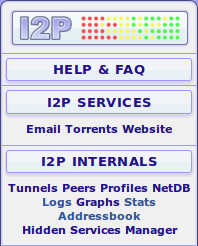  

Click on Tunnel Wizard  
  

If you need to connect to a remote service, such as an IRC server inside 
I2P or a code repository, then you will require a CLIENT tunnel. 
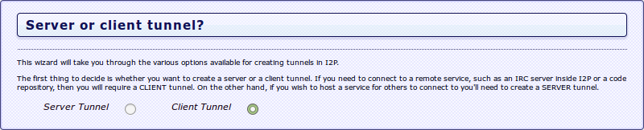  

Select SOCKS 4/4a/5 - A tunnel that implements the SOCKS protocol. 
This enables both TCP and UDP connections to be made through a SOCKS 
outproxy within I2P. 
<a href="../../img/tutorial/i2p/socks_proxy.png" target="_blank">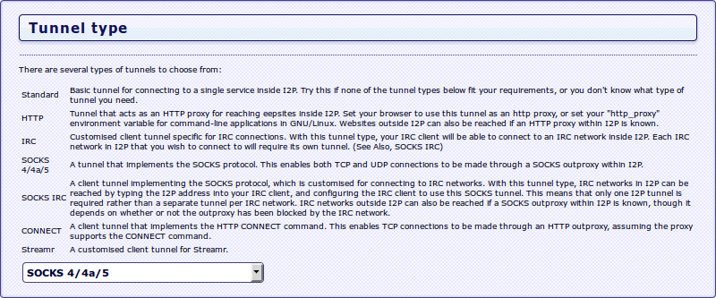</a>  

Choose a name and description for your tunnel. These can be anything you 
want - they are just for ease of identifying the tunnel in the routerconsole. 
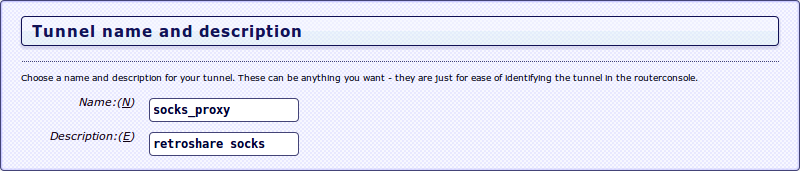  

Leave *Outproxies* empty
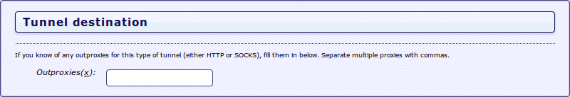  

This is the port that the client tunnel will be accessed from locally. 
This is also the client port for the HTTPBidir server tunnel.  

 - Select **4447** as RetroShare and I2P use this as the default  
 
How do you want this tunnel to be accessed? By just this machine, 
your entire subnet, or external internet? You will most likely want 
to just allow 127.0.0.1  

 - let I2P Proxy bind to **localhost/127.0.0.1** only  
 
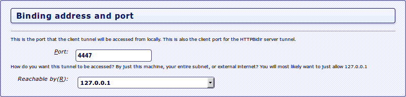   

The I2P router can automatically start this tunnel for you when the 
router is started. This can be useful for frequently-used tunnels 
(especially server tunnels), but for tunnels that are only used 
occassionally it would mean that the I2P router is creating and 
maintaining unnecessary tunnels.  
  

The wizard has now collected enough information to create your tunnel.  
<a href="../../img/tutorial/i2p/wizard_completed.png" target="_blank">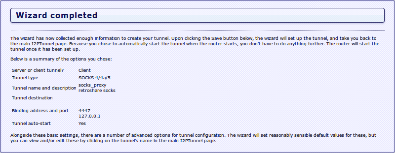</a>  

###Configure your hidden service  
For the incoming connections through I2P it's necessary to create a 
I2P Server Tunnel.  

Hidden Service Manager for creating this local tunnel should be located 
at [http://127.0.0.1:7657/i2ptunnelmgr](http://127.0.0.1:7657/i2ptunnelmgr)  
  

Click on Tunnel Wizard  
  

**Server or client tunnel?**  
This wizard will take you through the various options available for 
creating tunnels in I2P.  
The first thing to decide is whether you want to create a server or a 
client tunnel. If you need to connect to a remote service, such as an 
IRC server inside I2P or a code repository, then you will require a CLIENT tunnel.
 On the other hand, if you wish to host a service for others to connect to you'll need to create a SERVER tunnel.  
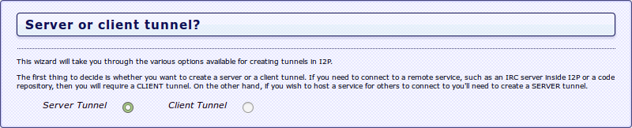  

**Tunnel type**  
There are several types of tunnels to choose from:
Standard	A basic server tunnel for hosting a generic service inside I2P. 
Try this if none of the tunnel types below fit your requirements, or 
you don't know what type of tunnel you need.  
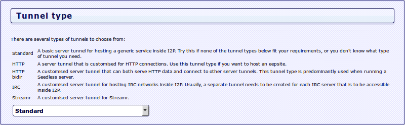  

**Tunnel name and description**  
Choose a name and description for your tunnel. These can be anything you 
want - they are just for ease of identifying the tunnel in the routerconsole.  
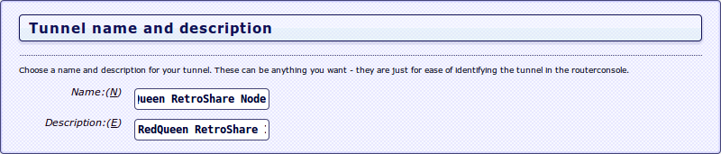  

**Binding address and port**  
This is the IP that your service is running on, this is usually on the 
same machine so 127.0.0.1 is autofilled.
Host(H): **127.0.0.1**  
This is the port that the service is accepting connections on.
Port(P): **41222** You can choose any random port.  
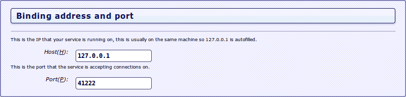  

**Tunnel auto-start**  
The I2P router can automatically start this tunnel for you when the 
router is started. This can be useful for frequently-used tunnels 
(especially server tunnels), but for tunnels that are only used 
occassionally it would mean that the I2P router is creating and 
maintaining unnecessary tunnels.  
  

The wizard has now collected enough information to create your tunnel.  
<a href="../../img/tutorial/i2p/server_wizard.png" target="_blank">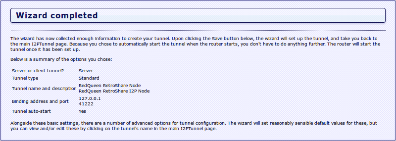</a>  

The status of the created tunnel and the tunnel ID (nnn.b32.i2p) is 
available at the **Hidden Service Manager**.  
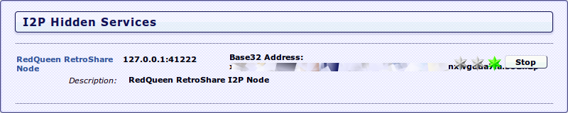  

Copy the Base32 address ending with *.b32.i2p*.  It will be needed 
for your RetroShare I2P Node Creation.  

##RetroShare I2P Setup  
For more details please also read [Create New User](../user-guide/first-steps/#create-new-profile) 
for clearnet IPv4 Network Node.  

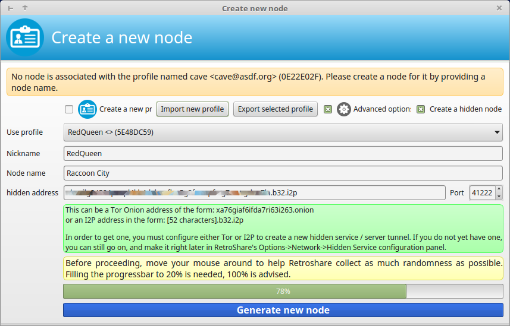  

###Network Configuration  
Check your [Network Config](../user-guide/settings/#network). It should 
look different to a normal setting. 

 - Hidden Node Indicator  
 - DHT is disabled in [Network Mode](/user-guide/settings/#network-mode)  
   Discovery is recommended, though also Darknet(Discovery & DHT are disabled) 
   may be used.  
 - Local Address is locked to localhost (127.0.0.1)  
 - external Address is hidden  
 - Known / Previous IPs are disabled   
 - external IP Checks are disabled  
 
<a href="../../img/tutorial/i2p/network_config.png" target="_blank">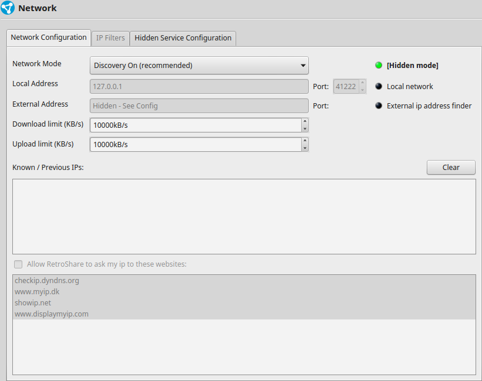</a>  
click to enlarge  

###Hidden Service Configuration  
####Outgoing Connections
 - Tor Socks Proxy  
   Tor also creates a SOCKS Proxy, which can be used to connect to Tor  
   Hidden RetroShare Nodes.  
 - The Indicator shows if the proxy is working.  
 - I2P Socks Proxy  
   Your [I2P Socks Proxy](../tutorial/i2p-hidden-rs-node/#outgoing-i2p-proxy) 
   is normally available at localhost and port 4447.  
 - The Indicator shows if the proxy is working.     

####Incoming Connections
 - Local Address
   This Address is locked to 127.0.0.1
    - Local Port  
      The Port where RetroShare is listening  
 - I2P Base32 Address  
   Here you need to enter the Hostname which has been created by the 
   [I2P Server Tunnel](../tutorial/i2p-hidden-rs-node/#configure-your-hidden-service).  
    - I2P Port  
      I2P Base32 do not listen to a specific port.  

   
<a href="../../img/tutorial/i2p/hidden_service_config.png" target="_blank">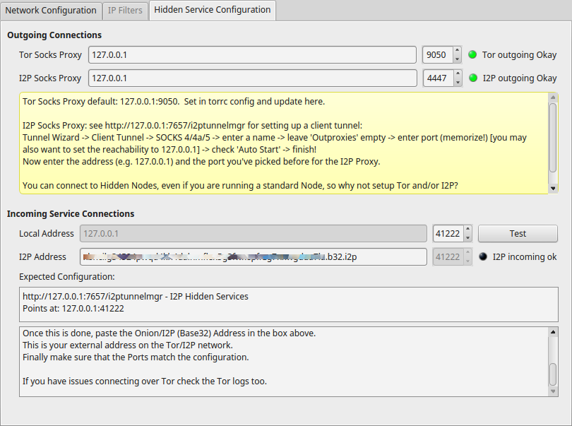</a>  
click to enlarge
