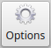
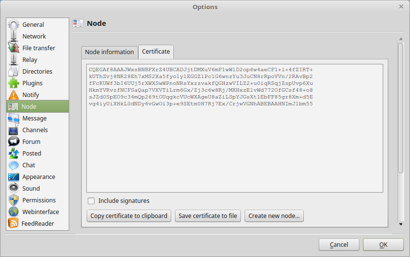
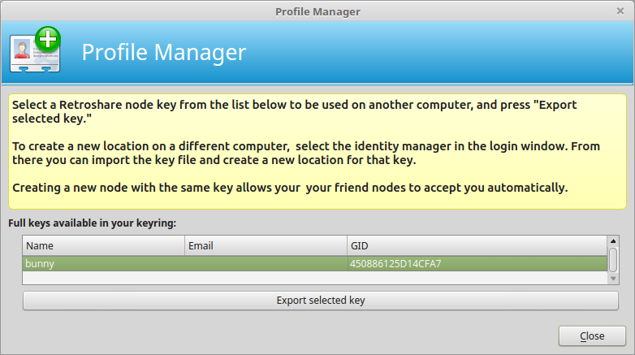
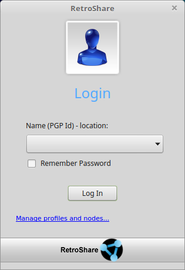
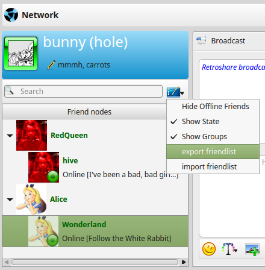
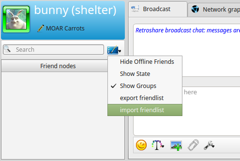
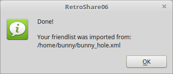
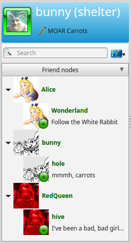
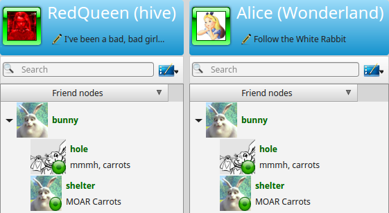

#Create new Location
##How to create a second location for an existing user account

If you want to use your RetroShare User account accross different 
Devices, for example on your PC, Laptop, NAS, Raspberry Pi , …  
its not necessary to create different Accounts for each device. 
It’s possible to create with the same user different locations, 
which are recognized by your friends as owned by your User automatically. 
This avoids the additional Key Exchange with all your friends when you 
use RetroShare on a new device. Each location can connect to friends 
where your User account is already in the friended.

Creating a new location with the same user is easy, if you know how.  

##Let’s start with a small example between Bunny, Alice and the RedQueen.  

Bunny owns his first location “hole” and is connected with 
Alice/Wonderland and RedQueen/Hive. On Bunny’s new PC he creates a 
new RetroShare node and imports his contacts from the first node. 
Bunnys friends do not need to take care to add the new location, it 
just gets listed at Bunny’s nodes in their contact list.  

 
If you want to do it similar to bunny, Its now explained in a 
Step by Step Guide.  

 

On your Fist Node, Go to Settings  

  

settings_button Submenu Mode -> Tab Certificate -> Create New Node  
  

Select the Identity to export in the Profile Manager  
  

Export it and save it with *.asc file ending.

This file contains the private GPG Key belonging to your RetroShare 
UserID. We are now able to create new nodes belonging to the same 
User with this file.  

Switch to your Second System where you want to create your new Node.  

Copy the .asc file to your new system and start RetroShare.  

  

Open “Manage profiles and nodes…”  

  

and Generate new Node

Now you are done, your new node is basically working. Though the Contact List is empty.

 

Next Step is moving your Contacts from your first node to your second node.

##Export your Contact List from your first Node into a .xml file.

  

Copy the File to your new node and import it there.

  

  

Your friends from your first location are now available on your second 
location. Your first node and your second node are also friended.

  

Alice and RedQueen are now able to see the new location of Bunny.

  

Thanks to sehraf for implementing the Export/Import Tool.

from <a href="https://blog.cavebeat.org/2015/09/how-to-create-a-second-location-for-an-existing-user-account/">blog.cavebeat.org</a> <a href="http://creativecommons.org/licenses/by-sa/4.0/">CC BY-SA 4.0</a>
