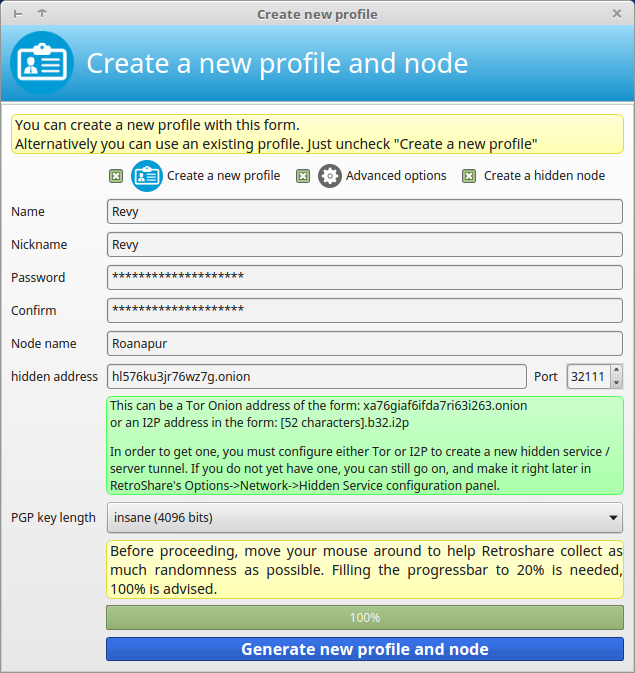
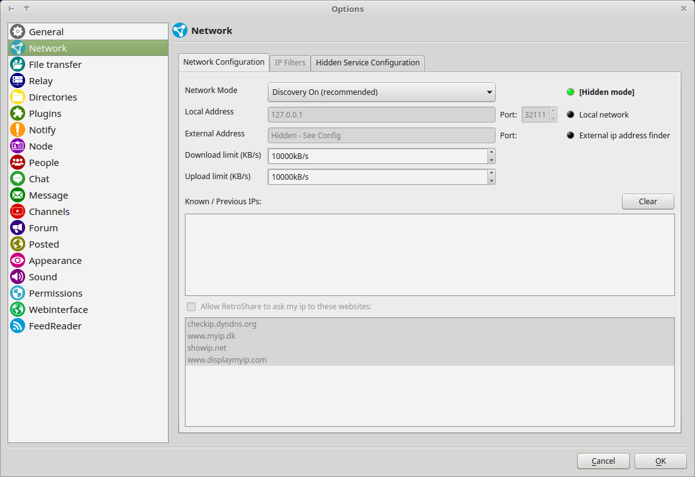
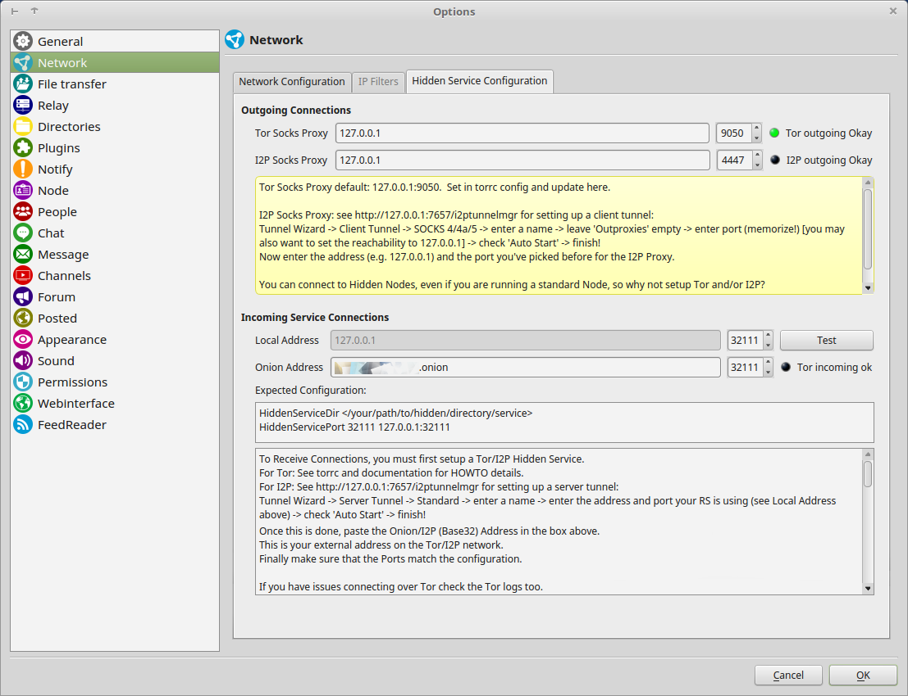
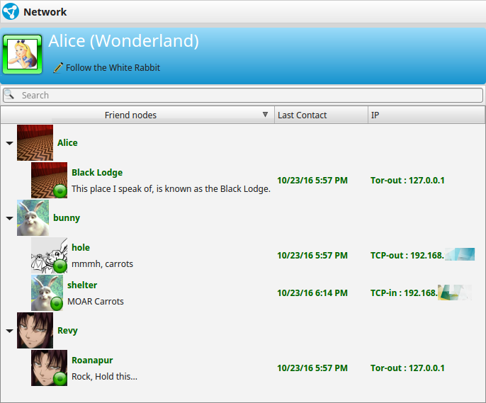
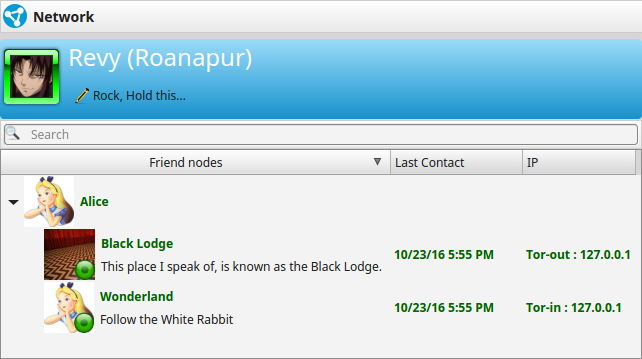

#Tor Hidden RetroShare Nodes  

If you want to use Tor for anonymous web browsing, please use [Tor 
Browser](https://www.torproject.org/projects/torbrowser.html.en). 
It comes with readily configured Tor and a browser patched 
for better anonymity.  
To use SOCKS-Proxy directly (for RetroShare, instant 
messaging, Jabber, IRC, etc), you can point your application directly at 
Tor (localhost port 9050, or port 9150 for Tor Browser), but see [this 
FAQ entry](https://www.torproject.org/docs/faq.html.en#TBBSocksPort) 
for why this may be dangerous. 

RetroShare can be run behind a [Tor Hidden Service](https://www.torproject.org/docs/hidden-services.html.en) 
for incoming connections. The outgoing connections are sent through a 
local Tor-Socks-Proxy.  
This makes it possible to obfuscate your metadata which could 
disclose your Network [Friend Graph](../concept/topology/#retroshare). 
The hidden service address (e.g. ld546kr3zr462z3p.onion) is replacing 
the IPv4 address (e.g. 192.168.1.216) as the listening address for incoming 
connections.  

Tor allows clients and relays to offer [hidden services](https://www.torproject.org/docs/tor-hidden-service.html.en). 
That is, you can offer a web server, SSH server, etc., without revealing your IP 
address to its users. In fact, because you don't use any public 
address, you can run a hidden service from behind your firewall.  

##Hidden Service Setup  
###Tor Installation
This Guide requires to have Tor already installed on your System.  
If not, please refer to the offical Tor Documentation on how to install Tor.  

 - [Tor on Debian/Ubuntu](https://www.torproject.org/docs/debian.html.en)  
 - [Tor on RPM based RHEL/CentOS/Fedora](https://www.torproject.org/docs/rpms.html.en)  
 - [Tor on MacOS](https://www.torproject.org/docs/tor-doc-osx.html.en)  

###Outgoing Tor Proxy
By default Tor will create a SOCKS Proxy on localhost for outgoing connections. 

    ## Tor opens a SOCKS proxy on port 9050 by default -- even if you don't
    ## configure one below. Set "SOCKSPort 0" if you plan to run Tor only
    ## as a relay, and not make any local application connections yourself.
    #SOCKSPort 9050 # Default: Bind to localhost:9050 for local connections.
    #SOCKSPort 192.168.0.1:9100 # Bind to this address:port too.

###Configure your hidden service 
On Debian/Ubuntu Systems go to your tor settings directory /etc/tor. 
Open your torrc file in your favorite text editor. Go to the middle 
section and look for the line: 

    ############### This section is just for location-hidden services ###
    
    ## Once you have configured a hidden service, you can look at the
    ## contents of the file ".../hidden_service/hostname" for the address
    ## to tell people.
    ##
    ## HiddenServicePort x y:z says to redirect requests on port x to the
    ## address y:z.
    
    #HiddenServiceDir /var/lib/tor/hidden_service/
    #HiddenServicePort 80 127.0.0.1:80

    #HiddenServiceDir /var/lib/tor/other_hidden_service/
    #HiddenServicePort 80 127.0.0.1:80
    #HiddenServicePort 22 127.0.0.1:22

The HiddenServicePort directive contains the port where the Hidden Service 
should listen and the local IP and the local Port where RetroShare is listening. 

Add a section for your hidden service.

    HiddenServiceDir /var/lib/tor/hidden_rs_revy/
    HiddenServicePort 32111 127.0.0.1:32111

 - HiddenServiceDir  
   The HiddenServiceDir directive tells Tor where to look for the Hidden 
   Service Directory containing the private key of the Hidden Service. 
   Each Hidden Service Owns it's own directory. 
   The directory needs to be created and having permissions of the Tor User.  
 - HiddenServicePort  
   The HiddenServicePort directive tells tor on which port to listen, to 
   forward to which ip and to which port.  

Go to */var/lib/tor/* and create a directory for your new Hidden Service. 
Change the owner of the directory to the user running tor. 

    root@laptop:/var/lib/tor# mkdir hidden_rs_revy  
    root@laptop:/var/lib/tor# chown debian-tor:debian-tor hidden_rs_revy/  
    root@laptop:/var/lib/tor# chmod 0700 hidden_rs_revy/  
    root@laptop:/var/lib/tor# ls -lha  
        total 9.8M
        drwx--S---  5 debian-tor debian-tor 4.0K Oct 23 12:26 .
        drwxr-xr-x 74 root       root       4.0K Apr 29 20:23 ..
        drwxr-sr-x  3 debian-tor debian-tor 4.0K Oct 21 21:34 .arm
        drwx--S---  2 debian-tor debian-tor 4.0K Oct 23 12:26 hidden_rs_revy
        -rw-------  1 debian-tor debian-tor    0 Oct 23 09:25 lock
        -rw-------  1 debian-tor debian-tor 6.1K Oct 23 12:26 state  

Restart your Tor Daemon. Tor will create a crypto key for your Hidden 
Service in the HiddenServiceDirectory. 

    root@laptop:/var/lib/tor# /etc/init.d/tor restart
        [ ok ] Stopping tor daemon...done.
        [ ok ] Starting tor daemon...done.
    root@laptop:/var/lib/tor# cd hidden_rs_revy/
    root@laptop:/var/lib/tor/hidden_rs_revy# ls
        hostname  private_key

The Hostname of your new Hidden Service will be available in the 
file *hostname* just created in your Hidden Service Directory.  

    root@laptop:/var/lib/tor/hidden_rs_revy# cat hostname  
        ld546kr3zr462z3p.onion

##RetroShare Tor Setup  

For more details please also read [Create New User](../user-guide/first-steps/#create-new-profile) 
for clearnet IPv4 Network Node.  

  

###Network Configuration  
Check your [Network Config](../user-guide/settings/#network). It should 
look different to a normal setting. 

 - Hidden Node Indicator  
 - DHT is disabled in [Network Mode](/user-guide/settings/#network-mode)  
   Discovery is recommended, though also Darknet(Discovery & DHT are disabled) 
   may be used.  
 - Local Address is locked to localhost (127.0.0.1)  
 - external Address is hidden  
 - Known / Previous IPs are disabled   
 - external IP Checks are disabled  
 
  
click to enlarge  

###Hidden Service Configuration  
####Outgoing Connections
 - Tor Socks Proxy
   Your [Tor Socks Proxy](../tutorial/tor-hidden-rs-node/#outgoing-tor-proxy) 
   is normally available at localhost and port 9050. 
 - The Indicator shows if the proxy is working. 
 - I2P Socks Proxy  
   I2P also creates a SOCKS Proxy, which can be used to connect to I2P 
   Hidden RetroShare Nodes.  

####Incoming Connections
 - Local Address
   This Address is locked to 127.0.0.1
    - Local Port  
      The Port where RetroShare is listening  
 - Onion Address  
   Here you need to enter the Hostname which has been created by the Tor 
   [HiddenServiceDir](../tutorial/tor-hidden-rs-node/#configure-your-hidden-service).  
    - Onion Port  
      The Port where the Hidden Service is listening

For an easier usage, both ports should be used symmetrically.  
   
  
click to enlarge
##Tor Usage  

###Normal Nodes
Normal Nodes may also use Tor Socks Proxy for outgoing connections 
to Hidden Services.  

  
Outgoing Tor Connections and Incoming&Outgoing TCP Connections

###Hidden Nodes
Outgoing connections are always routed through the local Tor Socks Proxy to .onion addresses. 
All Traffic is routed inside the Tor Network. Hidden Nodes cannot connect 
to IPv4/Normal Nodes, because Tor-Exit nodes are not used. 
Though the other way Normal Nodes can reach Hidden Nodes through Tor Socks Proxy. 

  
Tor connections incoming and outgoing from and to Hidden Nodes.
