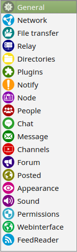
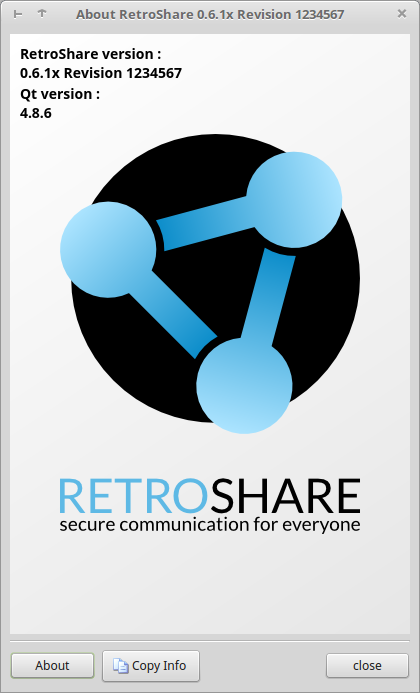
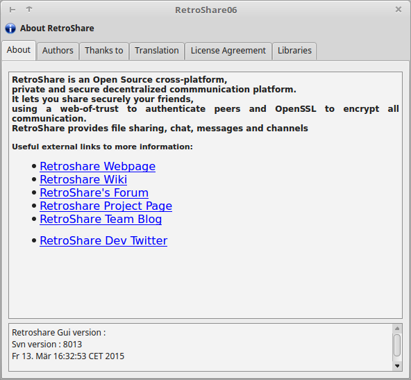
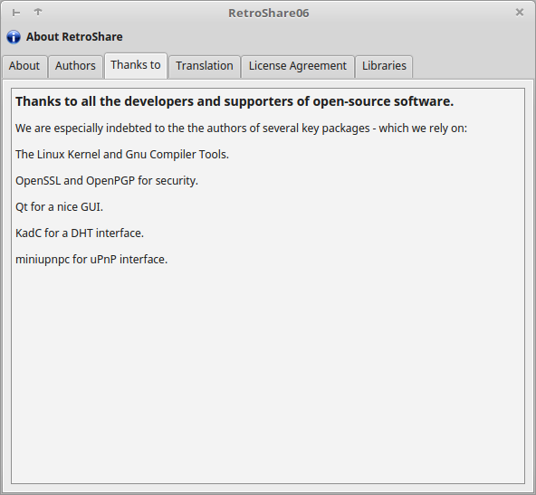
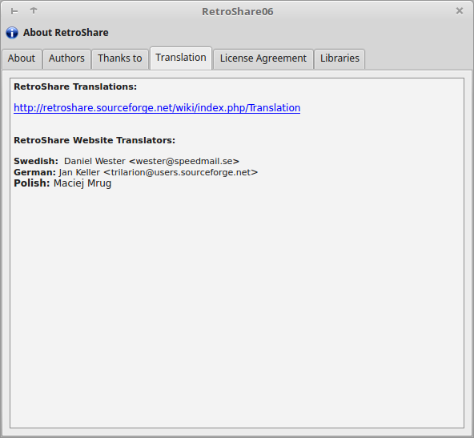
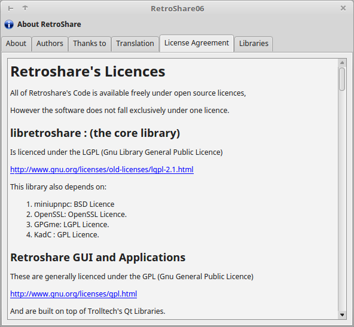

#Interface

##News-Feed
  

The News Feed diplays the last events on your network, sorted by the time you received them. This gives you a summary of the activity of your friends. You can configure which events to show by pressing on Options.  
The various events shown are:  
 - Connection attempts (useful to make friends with new people and cotnrol who's trying to reach you)
 - Channel and Forum posts
 - New Channel and Forums you can subscribe to 
 - Private messages from your friends

##Network
  
The Network tab shows your friend RetroShare nodes: the neighbor RetroShare nodes that are connected to you.  
You can group noed together to allow a finer level of information access, for instance to only allow some nodes to see some of your files. 

On the right, you will find 3 useful tabs:  
 - Broadcast sends messages to all connected nodes at once
 - Local network graph shows the network around you, based on discovery information
 - Keyring contains node keys you collected, mostly forwarded to you by your friend nodes

##People
  

**Identities**  
In this tab you can create/edit pseudo/anonymous identities, and circles. 

Identities are used to securely identify your data: sign messages in chat lobbies, forum and channel posts, receive feedback using RetroShare built-in email system, post comments after channel posts, chat using secured tunnels, etc. 

Identities cna optionally be signed by your RetroShare node's certificate. Signed identities are easier to trust but are easily linked to your node's IP address. 

Anonymous identities allow you to anonymously interact with other users. They cannot be spoofed, but noone can prove who really owns a given identity. 

Circles are groups if identities (anonymous or signed), that are shared at a distance over the network. They can be used to restrict the visibility to forums, channels, etc. 

A circle can be restricted to another circle, thereby limiting it's visibility to members of that circle or even self-restricted, meaning that it is only visible to invited members. 

##File Sharing
  
RetroShare birngs two ways fo transferring files: direct file transfers from your friends, and distant anonymous tunneled transfers. In addition, file transfer is multi-source and allows swarming (you can be source while downloading).  

You can share files using the "Directory Plus" icon from the left side bar. These files will be listed in the My Files tab. You can decide for each friend group wheter they can or not see these files in their Friends Files tab. 

The search tab reports files from your friends' file lists, and distant files that can be reached anonymously using the multi-hop tunneling system. 

##Chat Lobbies
  
Chat lobbies are distributed chat rooms, and work pretty much like IRC. They allow you to talk anonymously with tons of people without the need to make friends.  

A chat lobby can be public (your friends see it) or private (your friends can't see it, unless you invite them with +). Once you have been invited to a private lobby, you will be able o see it when your friends are using it.  

The list at the left shows chat lobbies your friends are participating in. You can either  
 - Right click to create a new chat lobby 
 - Double click a chat lobby to enter, chat and show it to your friends

Note: For the chat lobbies to work properly, your computer needs be on time. So check your systems clock!

##Messages
  
RetroShare has its own internal email system. You can send/receive emails to/from connected friend nodes.  

It is also possible to send messages to other people's Identities using the global routing system. These messages are always encrypted and signed, and are relayed by intermediate nodes until they reach their final destination. 

Distant messages stay into your Outbox untial an acknowledgment of receipt has been received. 

Generally, you mey use messages to recommended files to your friends by pasting file links, or recommend friend nodes to other friend nodes, in order to strenghten your networ, or send feedback to a channel's owner. 

##Channels
  
Channels allow sou to paost data (e.g. movies, music) that will spread the network

You can see the channels your friends are subscribed to, and you automatically forward subscribed channels to your friends. 
This promotes good channels in the network. 

Only the channel's creator can post on that channel. Other peers in the network can only read from it, unless the channel is private. You can however share the posting rights or the reading rights with friend RetroShare nodes. 

Channels can be made anonymous, or attached to a RetroShare identity so that readers can contact you if needed. Enable "Allow Comments" if you want to let users comment on your posts. 

Channel posts get deleted after 4 months. 

##Forums
  
RetroShare Forums look like internet forums, but they wirk in a decentralized way. 

You see forums your friends are subscribed to, and you forward subscribed forums to your friends. This automatically promotes interresting forums in the network. 

Forum messages get deleted after 12 months. 

##Posted
  

Plugin Posted

##FeedReader 
 

The posted service allows to share internet links, that spread among RetroShare nodes like forums and channels. 

Links can be commented by subscribed users. A promotion system also gives the opportunity to enlight important links.  

There is no restriction on which links are shared. Be carefull when clicking on them. 

Posted links get deleted after 4 months. 

##Add
  

##Options
 

The [Options/Settings](/user-guide/settings/) are explained more detailed in the Settings. 

  

##About
  

###About
The about section shows the RetroShare version and Revision and Qt Version 
 

####About RetroShare
Contains a small description and links to:  
 - [RetroShare WebSite](http://retroshare.github.io)  
 - [legacy WebSite](http://retroshare.sourceforge.net) on SourceForge has been renewed  
 - [legacy Wiki](http://retroshare.sourceforge.net) on SourceForge  
 - [RetroShare Organization on GitHub](https://github.com/RetroShare)  
 - [RetroShare Forum](http://retroshare.sourceforge.net)  
 - [DevBlog](https://github.com/RetroShare)  
 - [Twitter](https://twitter.com/retroshare)  
  

####Authors
Over the years lot of different People have helped to improve RetroShare. 

To be named in front:  
Lead Developer *csoler*  
Founder *drBob*  

and many many more

 

####Thanks to

nanos gigantum humeris insidentes - dwarfs standing on the shoulders of giants  

RetroShare couldn't exist without the building upon the work of other great projects. 

 

####Translation

 

####License Agreement

 

##Quit
 

To close RetroShare click on the quit button and choose yes at the popup. 

 

