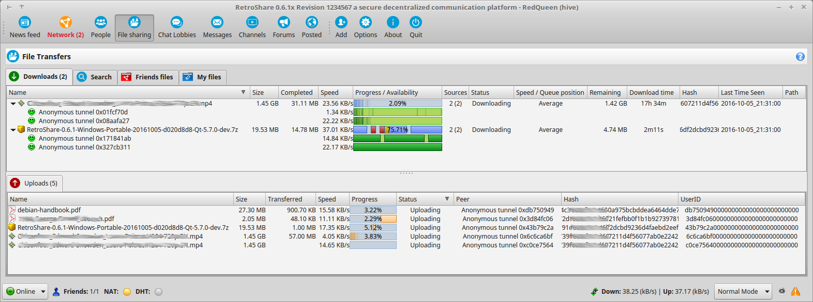

#Interface

##News-Feed
  

The News Feed diplays the last events on your network, 
sorted by the time you received them. 
This gives you a summary of the activity of your friends. 
You can configure which events to show by pressing on [Options](../user-guide/settings/#notify).  

The various events shown are:  

 - Connection attempts (useful to make friends with new people and cotnrol who's trying to reach you)
 - Channel and Forum posts
 - New Channel and Forums you can subscribe to 
 - Private messages from your friends

  
This shows an entry in the newsfeed because a friend came online, 
and this friend sent a message. 

##Network
  
The Network tab shows your friend RetroShare nodes: the neighbor RetroShare nodes that are connected to you.  
You can group noed together to allow a finer level of information access, for instance to only allow some nodes to see some of your files. 

On the right, you will find 3 useful tabs:

 - [Broadcast](../user-guide/interface/#broadcast)  
   sends messages to all connected nodes at once
 - [Local network graph](../user-guide/interface/#network-graph)  
   shows the network around you, based on discovery information
 - [Keyring](../user-guide/interface/#keyring)  
   contains node keys you collected, mostly forwarded to you by your friend nodes

  
The Red Queen is having a friend in here Network/Friendlist. 
It's the User Bunny and RedQueen is connected to both of his Locations. 
Bunny runs two different locations. One for each of his device. 
The location *shelter* is running on his laptop, and the location *hole* 
is on his personal Computer. 

###Change Avatar
  
By clicking on the default Avatar Icon you can set your avatar picture 
to any picture you prefer. 

  
Only your friends will be able to see it. You can also change it later on.  

  

###Status Message
  
Your status message will be shown in the Network/Friendlist of your friends 
beside your Avatar. 
  

###Friendlist

Friends are sorted by name or by state. 

  

The columns with the last contact and ip can be enabled with right click.  
  

###Broadcast
The Broadcast Chat sends a message to all online friends at once. 
  

###Network Graph
The network graph shows all friends and their interconnections. 
Bunny has friended with Alice and RedQueen. 
  

###Keyring
RetroShare collects keys from other nodes in the network, 
mostly forwarded by friends.  
  

Columns of the Keyring 

 - Do you accept connections signed by this key  
 - Name of the Key  
 - This column indicates the trust level and wheter you signed their key  
 - Did that peer sign your key  
 - Certificate ID  
 - Last time this certificate has been used
 
 Colours
 
 - Yellow is your own Key  
 - Green are Friends  
 - Grey are Persons  

##People
  

Identities are used to securely identify your data: sign messages in chat 
lobbies, forum and channel posts, receive feedback using RetroShare 
built-in email system, post comments after channel posts, 
chat using secured tunnels, etc. 

  

###Identities  
Two kinds of Identities can be utilized. 

Click the  
Icon to create a new Identity  

####Pseudonymous Identities
Identities can optionally be signed by your RetroShare node's certificate. 
Signed identities are easier to trust but are easily linked to your node's IP address. 

  

 - Identiy Name  
   Name of the Identity. It is not necessary to use the same name as  
   your Node User. But it's common.  
 - Identity ID  
   Each Identity has it's own crypto hash ID number.  
 - Type  
   Owned by you and linked to your RetroShare Node. Instead of Anonymous  
 - Owner Node ID  
   GPG-ID Number used by your [Node](../user-guide/settings/#public-information)
 - Owner Node Name  
   User Name of your Node User  
 - Last Used  
   Last time the Identity has been in use. This can be a forum post or 
   anything else. 
 - Your opinion  
   Your opininon on your owned ID is Neutral. This is used to rate other ID's for a 
   reputation system. 
 - Auto-Ban all identities from this node  
   Ban all ID's from a specific node. 
 - Neighbor nodes  
   Average opinion of neighbor nodes about this identity. 
   Negative is bad, positive is good. Zero is neutral.
 - Overall  
   Overall reputation score, accounting for yours and your friends'. 
   Negative is bad, positive is good. Zero is neutral. If the score is too 
   low, the identity is flagged as bad, and will be filtered out in forums, 
   chat lobbies, channels, etc. 

  

####Anonymous Identities
Anonymous identities allow you to anonymously interact with other users. 
They cannot be spoofed, but noone can prove who really owns a given identity. 

 

 - Identity Name  
   Name of the Identity. Can be named anything. 
 - Identity ID  
   Each Identity has it's own crypto hash ID number.  
 - Type  
   Anonymous identity
 - Last Used  
   Last time the Identity has been in use. This can be a forum post or 
   anything else. 
 - Your opinion  
   Your opininon on your owned ID is Neutral. This is used to rate other ID's for a 
   reputation system. 
 - Neighbor nodes  
   Average opinion of neighbor nodes about this identity. 
   Negative is bad, positive is good. Zero is neutral.
 - Overall  
   Overall reputation score, accounting for yours and your friends'. 
   Negative is bad, positive is good. Zero is neutral. If the score is too 
   low, the identity is flagged as bad, and will be filtered out in forums, 
   chat lobbies, channels, etc.    
 
 

###Circles
 

Circles are groups of identities (anonymous or signed), that are shared at a distance over the network. They can be used to restrict the visibility to forums, channels, etc.  
A circle can be restricted to another circle, thereby limiting it's visibility to members of that circle or even self-restricted, meaning that it is only visible to invited members.  

####Create Circles

Click the  
Icon to create a new Identity  

 -  Public  
   Publicly distributed circles, are visible to your friends, which 
   will get to know the circle data (Creator, members, etc)
 -   Private  
   Private (a.k.a. self-restricted) circles are only visible to the 
   invited members of these circles. In practice the circle uses its own list 
   of invited members to limit its own distribution. 
 -  Only visible to members of another Circle  
   Circles can be restricted to the members of another circle. 
   Only the members of that second circle will be allowed to see the new 
   circle and its contents (list of members, etc).
 - Invited Members  
   Members of this list will be automatically proposed to join the circle (by accepting membership). 
   They will not receive data that is restricted to this circle until they do so. 

The circle name, contact author and invited member list will be visible 
to all invited members. If the cricle is not private, it will also be visible to neighbor nodes 
of the nodes who host the invited members. 

 

####Join Circles

 

Accept your circle invitation by right clicking  
  

  

##File Sharing
  

RetroShare birngs two ways fo transferring files: 

 - direct file transfers from your friends
 - distant anonymous tunneled transfers  
In addition, file transfer is multi-source and allows swarming (you can be source while downloading).  

In this Screenshot, the files are not yet finished and still start to upload to other friends. 
##File Sharing
  

RetroShare birngs two ways fo transferring files: 

 - direct file transfers from your friends
 - distant anonymous tunneled transfers  
In addition, file transfer is multi-source and allows swarming (you can be source while downloading).  

In this Screenshot, the files are not yet finished and still start to upload to other friends. 

###Download
  

Columns from the Download Tab   

 - Name  
   Name of the file    
 - Size  
   Size of the downloaded  
 - Completed  
   already downloaded size  
 - Speed  
   actual speed of the download  
 - Progress / Availability  
   each Chunk (1 Chunk = 1MB part) is shows it status by colour
     
    - Blue - already finished
    - Red - active download
    - Yellow - calculating checksums
    - empty - not downloaded yet
    
 - Sources  
   active sources in brackets the total number of available files in the network   
 - Status  
    - Waiting
    - Downloading  
    - Paused  
      manually paused state, can be resumed also  
    - Checking  
      calculating checksums of all Chunks of the Download  
    - Completed  
      The Download has finished, and should be available in the Download Directorie
 - Speed / Queue position   
    - Faster  
    - Average  
    - Slower   
 - Remaining  
   remaining file size to download till it's finished
 - Download Time  
   estimated time to finish the download  
 - Hash  
   Hash number of the file [SHA1](https://en.wikipedia.org/wiki/SHA-1)
 - Last Time Seen  
   last time when the source of this file has been available  
 - Path  
   destination folder

###Multiple Sources  
Multi Sources are shown in the Sources Column and can be 
displayed in detail by clicking the dropdown button

 -  active source transferring data  
 -  no data currently transferring  

###Context Menu  
By right-clicking on the download, the Context menu provides actions to the user.

 

 - Priority  
     
 - Chunk Strategy  
     
 - Rename file...  
 - Set destination directory  
     
   Set the directory where the file should be put when it's completed
 - Pause  
   Pause the download and resume it later
 - Force Check  
   Trigger a check of the checksums manually
 - Cancel  
   Stop the download
 - Open Folder  
   Open the Folder where the file has been downloaded
 - Details...  
   show Details from the download.
     
 - Clear Completed  
   removes finished downloads, and removes them from the Download Tab  
 - Copy RetroShare Link  
   copy the RetroShare Link to the Clipboard  
   
        retroshare://file?name=RetroShare-0.6.1-Windows-Portable-20161005-d020d8d8-Qt-5.7.0-dev.7z&size=20476577&hash=d5d91d4ec9438c6df2dcbd9236d4faebd2eef75d
   
     
   
 - Expand all  
   Open all downloads with multi source dropdown buttons
 - Collapse all  
   Collapes all downloads with open multisources 
 - Collection  
     
    - download from **.rscollection** files 
   
You can share files using the "Directory Plus" icon from the left side bar. These files will be listed in the My Files tab. You can decide for each friend group wheter they can or not see these files in their Friends Files tab. 

The search tab reports files from your friends' file lists, and distant files that can be reached anonymously using the multi-hop tunneling system. 

##Chat Lobbies
  
Chat lobbies are distributed chat rooms, and work pretty much like 
[IRC](https://en.wikipedia.org/wiki/Internet_Relay_Chat) or 
[XMPP/Jabber](https://de.wikipedia.org/wiki/Extensible_Messaging_and_Presence_Protocol). 
They allow you to talk anonymously with tons of people without the need to make friends. 
Chatrooms are decentralized and serverless. This means they do not require a central server and are shared between direct friends. 

  

###Types of Chat Rooms  
 - Public Chatrooms  
   You can join all chatrooms which are subscribed by your friends. 
   Your friends will be able to join all chatrooms which you have subscribed.  
 - Privat Chatrooms  
   This chatrooms is only visible by friends  
   
A chat lobby can be public (your friends see it) or private (your friends can't see it, unless you invite them with +). 
Once you have been invited to a private lobby, you will be able o see it when your friends are using it.  

The list at the left shows chat lobbies your friends are participating in. You can either  
 - Right click to create a new chat lobby 
 - Double click a chat lobby to enter, chat and show it to your friends

Note: For the chat lobbies to work properly, your computer needs be on time. So check your systems clock!

##Messages
  
RetroShare has its own internal email system. You can send/receive emails to/from connected friend nodes.  

It is also possible to send messages to other people's Identities using the global routing system. These messages are always encrypted and signed, and are relayed by intermediate nodes until they reach their final destination. 

Distant messages stay into your Outbox untial an acknowledgment of receipt has been received. 

Generally, you mey use messages to recommended files to your friends by pasting file links, or recommend friend nodes to other friend nodes, in order to strenghten your networ, or send feedback to a channel's owner. 

##Channels
  
Channels allow sou to paost data (e.g. movies, music) that will spread the network

You can see the channels your friends are subscribed to, and you automatically forward subscribed channels to your friends. 
This promotes good channels in the network. 

Only the channel's creator can post on that channel. Other peers in the network can only read from it, unless the channel is private. You can however share the posting rights or the reading rights with friend RetroShare nodes. 

Channels can be made anonymous, or attached to a RetroShare identity so that readers can contact you if needed. Enable "Allow Comments" if you want to let users comment on your posts. 

Channel posts get deleted after 4 months. 

##Forums
  
RetroShare Forums look like internet forums, but they wirk in a decentralized way. 

You see forums your friends are subscribed to, and you forward subscribed forums to your friends. This automatically promotes interresting forums in the network. 

Forum messages get deleted after 12 months. 

##Posted
  

Plugin Posted

##FeedReader 
 

The posted service allows to share internet links, that spread among RetroShare nodes like forums and channels. 

Links can be commented by subscribed users. A promotion system also gives the opportunity to enlight important links.  

There is no restriction on which links are shared. Be carefull when clicking on them. 

Posted links get deleted after 4 months. 

##Add
  

##Options
 

The [Options/Settings](/user-guide/settings/) are explained more detailed in the Settings. 

  

##About
  

###About
The about section shows the RetroShare version and Revision and Qt Version 
 

####About RetroShare
Contains a small description and links to:  
 - [RetroShare WebSite](http://retroshare.github.io)  
 - [legacy WebSite](http://retroshare.sourceforge.net) on SourceForge has been renewed  
 - [legacy Wiki](http://retroshare.sourceforge.net) on SourceForge  
 - [RetroShare Organization on GitHub](https://github.com/RetroShare)  
 - [RetroShare Forum](http://retroshare.sourceforge.net)  
 - [DevBlog](https://github.com/RetroShare)  
 - [Twitter](https://twitter.com/retroshare)  
  

####Authors
Over the years lot of different People have helped to improve RetroShare. 

To be named in front:  
Lead Developer *csoler*  
Founder *drBob*  

and many many more

 

####Thanks to

nanos gigantum humeris insidentes - dwarfs standing on the shoulders of giants  

RetroShare couldn't exist without the building upon the work of other great projects. 

 

####Translation

 

####License Agreement

 

##Quit
 

To close RetroShare click on the quit button and choose yes at the popup. 

 

