#rscollection
  

A rscollection file is a computer file that contains metadata about 
files and folders to be distributed. 

##Structure
A rscollection file does not contain the content to be distributed; 
it only contains information about those files, such as their names, 
sizes, folder structure, and cryptographic hash values for verifying file integrity. 

 - folder structure
 - files
   - size
   - hash [SHA1](https://en.wikipedia.org/wiki/SHA-1) 
   - name  
       
```bash 
<!DOCTYPE RsCollection>
<RsCollection>
 <Directory name="upfree26">
  <File size="66538" sha1="d2da911d9bb8574acdf9408100d165b604af023d" name="wubatman_tang.jpg"/>
  <File size="453096" sha1="f7177de4db9539dc7cb0bc56287a742816a54bb3" name="animal_audition.jpg"/>
  <File size="3719327" sha1="497af8313862994836ced6ce45b8afe05509875e" name="upfree26-Track01.mp3"/>
  <File size="5781894" sha1="f9994026b7a4f64e45d851e9407cea44d33e4440" name="upfree26-Track02.mp3"/>
  <File size="7174953" sha1="bde59d27d4155aa68ec1653fb1b5a7e7fdc6e0f9" name="upfree26-Track03.mp3"/>
  <File size="6867132" sha1="fe41399e7e9d23e9c14287d757e4edc323cd0fbd" name="upfree26-Track04.mp3"/>
  <File size="7576847" sha1="8437d792f7a1efac21720f0cf5e4ab11746042a2" name="upfree26-Track05.mp3"/>
  <File size="7034613" sha1="6b6afad6e42737ff3f931e775360fb9fda4942f8" name="upfree26-Track06.mp3"/>
  <File size="6202579" sha1="ea11dcfb0c3a019907afb9e8e62929f9c7a1161f" name="upfree26-Track07.mp3"/>
  <File size="4412669" sha1="851a053a64d316c1ffc96bbe2a4bb3b6b66f89c7" name="upfree26-Track08.mp3"/>
  <File size="2694227" sha1="b915c00c00828e18c06bdfded902711b9a1307f5" name="upfree26-Track09.mp3"/>
  <File size="5151227" sha1="84cd36034f73d5d566cc384b3c95c21f3a249729" name="upfree26-Track10.mp3"/>
  <File size="4345608" sha1="cf49446781badd332ef4979ecbe42c152756e92f" name="upfree26-Track11.mp3"/>
 </Directory>
</RsCollection>
```

The link to this collection: 

    # Plain Text of a .rscollection link
    retroshare://file?name=Animal%20Audition%20-%20Tracky%20Birthday%20%28upfree26%202008%29.rscollection&size=1404&hash=b2ab45326663d711c780007f5a2d84f7b5605bbe


##rscollection Creation
Go to *File Sharing* and *My Files*.There select the directory you want 
create a *.rscollection* file. 
It's important to have the files in a shared directory, so the person 
to use the *.rscollection* can access them through turtle-routing.  

In this case the *upfree26* directory is used to create the rsCollection.  
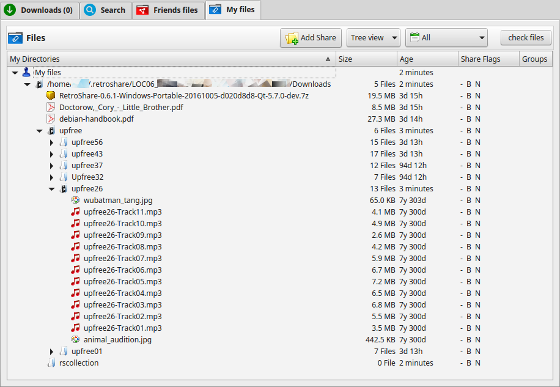  

Right click on the directory which should be used for the *.rscollection*.  
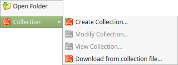  

Select a directory where to store the *.rscollection* file. This directory 
should also be a shared directory. So the .rsc could also be downloaded as well.   
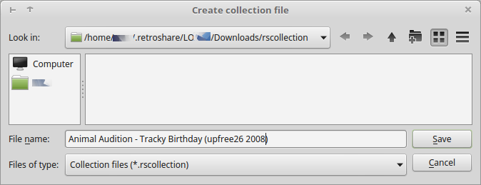  

In the editor it's possible to change the content of the *.rscollection* 
and to add or remove single files or entire directory trees.  
<a href="../../img/rscollection/step3_edit_rsc.png" target="_blank">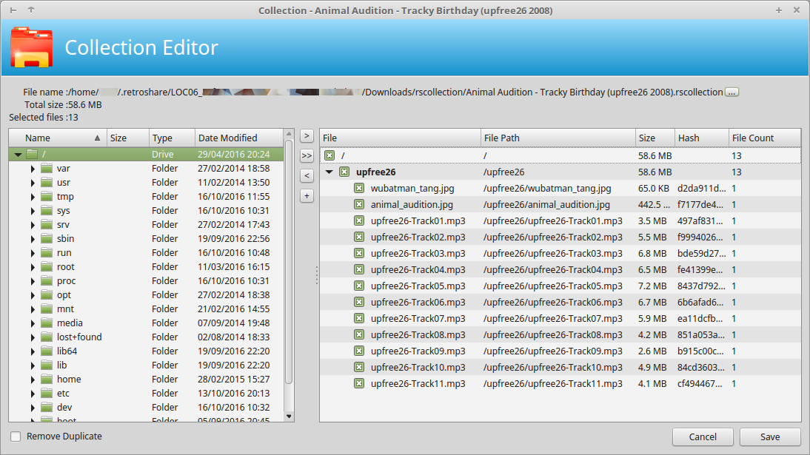</a>  

The *.rscollection* should be now available in the shared folder.  
  

When you right click on the file you can copy the link of the *.rscollection* 
to the clipboard.  
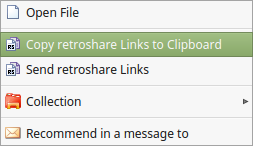  

This link can be pasted into chatrooms, instant messages, mails, channels or 
directly onto the internet. 

    # Plain Text of a .rscollection
    retroshare://file?name=Animal%20Audition%20-%20Tracky%20Birthday%20%28upfree26%202008%29.rscollection&size=1404&hash=b2ab45326663d711c780007f5a2d84f7b5605bbe

By rightclicking in the chatroom for example, you can paste the 
plaintext of the link or already formatted as RetroShare Link.  
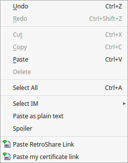  

A RetroShare link has the function of a [magnet link](https://en.wikipedia.org/wiki/Magnet_URI_scheme) 
spoken in BitTorrent Terms.  

In the chatroom it looks like this for the creator/poster of the link.  
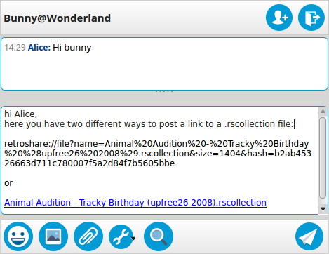  


##rscollection Download
You can receive a .rscollection in various ways. Download the file 
over the internet, get it by e-mail or receive it inside RetroShare (
chatroom, channel, instant message, mail, ...).  

If you receive it via chat it looks like this:  
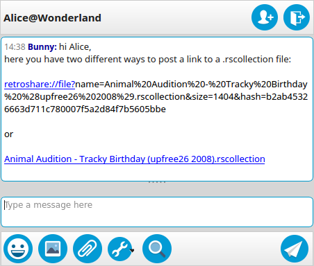  

So Alice has received a link from Bunny and may click on it to download 
the .rscollection file. 
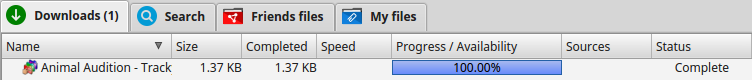  

When the download finishes right click it to start the .rscollection.  
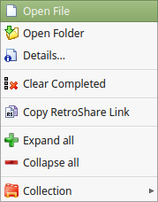  

A Collection Editor Pop's up to show which files are going to be downloaded. 
Selection and deselection of single files can be done.  
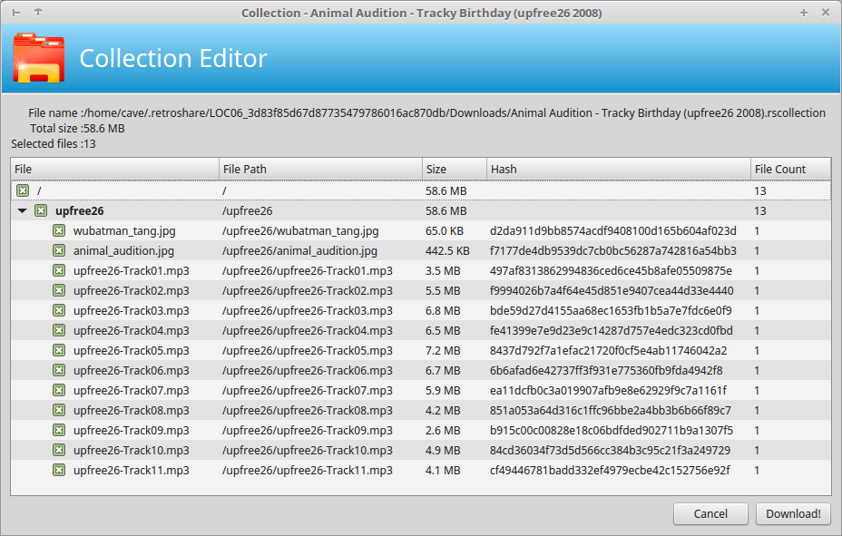  


The files from the .rscollection should pop up in your download tab and 
start loading if there is a source available.  
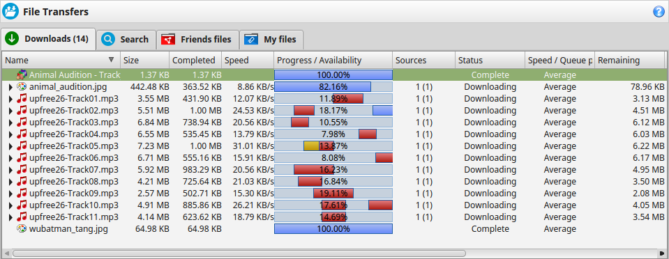  


<sub>Animal Audition - Tracky Birthday [upfree26](http://www.upitup.com/releases/upfree26) [CC BY-NC-SA 3.0 US](https://creativecommons.org/licenses/by-nc-sa/3.0/us/)</sub>
