#Settings

##General
  
###Startup
 - Start minimized  
Starts RetroShare directly to the Systray into the background.  
###For Advanced Users
 - Enable Advanced Mode (Restart required)  
Enables Advanced Settings which are hidden by default. 
###Misc
 - Do not show the Quit RetroShare Messagebox  
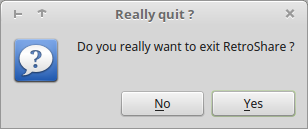 
 - Minimize to Tray Icon  
 - Auto Login  
When RetroShare is started the next time, it bypassed the question to select the User. And just starts with the actually used one.  
 - Use Local Server to get new arguments  
This enables to open RetroShare links from external programs, for example if you click on a link in your Browser (e.g. Firefox ). 
###Idle
 - Idle Time (default 300s)  
The Status switches to "away" after not using the computer for 5 minutes.  
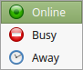  

###Launch Startup Wizard
  
This QuickStart wizard can help you to configure your RetroShare in a few simple steps.  
If you are a more advanced user, you can access the full range of RetroShare Settings via the ToolBar.  

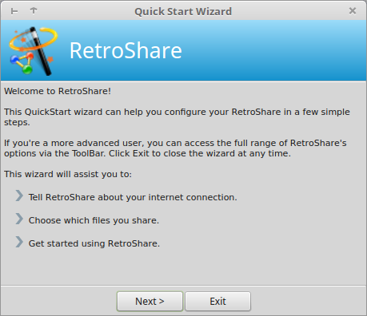  
This wizard will assist you to:  

 - Tell RetroShare about your internet connection  
 - Choose which files you share  
 - Get started using RetroShare  

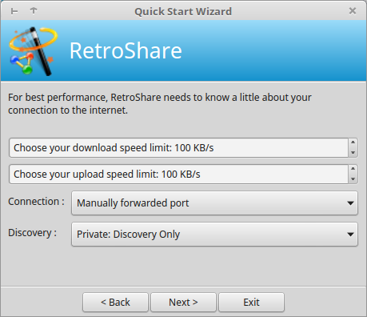  
For best performance, RetroShare needs to know a little about your connection to the internet.  
For detailed explanation of network settings click [here](settings/#network). 

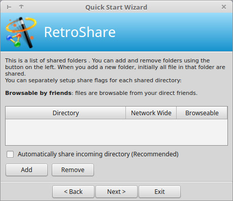  
This is a list of shared folders. You can add and remove folders using the button on the left. When you add a new folder, initially all files in that folders shared.  
You can separately setup share flags for each shared directory: 
For detailed explanation of shared directories click [here](settings/#directories). 

##Network
  
###Network Configuration

####Network Mode  
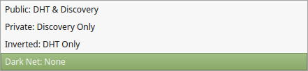  

 - Public: DHT & Discovery  
   both combined  
 - Private: Discovery  
   The Discovery service sends node name and ids of your trusted contacts to connected peers, to help them choose new friends. The friendship is never automatic however, and both peers still need to trust each other to allow connection. 
   If you want to connect to a friend, but the IP and the port of your friend has changed since your last connection, it's possible to find out the new IP+Port via Discovery. A mutual friend can tell each other your new changed IP so you can connect again. 
 - Inverted: DHT
   The DHT allows you to answer connection requests from your friends using BitTorrent's DHT. It greatly improves the connectivity. No information is actually stored in the DHT. It is only used as a proxy system to get in touch with other RetroShare nodes. 
 - DarkNet: None  
   This is used if neither DHT nor Discovery is wanted. Tor and I2P hidden nodes use this by default as they already have a fixed address to connect to. 

####Nat
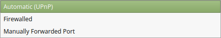  

 - Automatic (UPnP)
   The UPnP (Universal Plug and Play) protocol is supported by most home adsl/cable routers. With UPnP RetroShare can open itself a port at the Router to be able to listen for incoming connections.
 - Firewalled
   Lorem Ipsum
 - Manually Forwarded Port
   In your Home Router is normally an option to open Ports on their firewall. This allow others to reach your Node from the Internet. 

####Local Address  
 - Displays your Local LAN Address, for example: 192.168.1.55
 - Internal Port on your RetroShare Node. Acceptable Port Range from 10 to 65335. Normally Ports below 1024 are reserved by your system. If possible, keep internal and external Port the same. 

####External Address  
 - Displays the external address, your public IPv4. 
 - External Port. The port where your Router is Port Forwarding to your RetroShare Node. Acceptable Port Range from 10 to 65335. Normally Ports below 1024 are reserved by your system. 

####Dynamic DNS  
 - Dynamic DNS (DDNS or DynDNS) is a method of automatically updating a domain for non-static IP addresses. The router can update the DynDNS Provider everytime the external IP Address has changed. And Point the Domain back to your IP.  
   To Set up DynDNS at your router check [openwrt.org/wiki/DDNS](https://wiki.openwrt.org/doc/howto/ddns.client?s[]=dyndns) or [dd-wrt.com/wiki/DDNS](https://www.dd-wrt.com/wiki/index.php/DDNS). Other proprietary Router Operating Systems have similar options for DynDNS. 
   [https://freedns.afraid.org/](https://freedns.afraid.org/) is a DynDNS Provider which can be used among many others.  

####Download Limit (KB/s)
Set the maximum traffic speed RetroShare can utilize for download. Measured in KiloBytes per second. 1 Mbit/s == 125 kByte/s

####Upload Limit (KB/s)
Set the maximum traffic speed RetroShare can download for upload. Measured in KiloBytes per second. 1 Mbit/s == 125 kByte/s

####Known / Previous IP's
RetroShare remembers the last 4 used internal and the last 4 used external IP's. 
This list can be cleared. 

####Show Discovery information in statusbar
Displays Information about the Discovery Service when Information is received or sent to or from friends. 

####Allow RetroShare to ask my ip to these websites
RetroShare ask's a few Websites to determin it's external IP address. 

###IP filtering
####activate IP filtering
RetroShare can block unwanted IP addresses which seem to be malicious. 
####IP blacklist  
####IP whitelist
####Ban every IP reported by your friends
####Ban every masquerading IP reported by your DHT
####Automatically ban ranges of DHT masquerading IP's starting at 
####Manual input
You can insert manually IP ranges to be banned or to be whitelisted. 

###Hidden Service Configuration
####Outgoing Connections  

 - Tor Socks Proxy  
   This is usually 127.0.0.1/localhost and port 9050. The green light shows if outgoing connections through the proxy seem to work. 
 - I2P Socks Proxy  
   This is usually 127.0.0.1/localhost and port 4447. 
   
You can connect to Hidden Nodes, even if you are running a standard Node, so why not setup Tor and/or I2P?

##File Transfer
  

RetroShare is capable of transferring data and search requests between peers that are not necessarily friends. This traffic however only transits through a connected list of friends and is anonymous.

You can separately setup share flags for each shared directory in the shared files dialog to be:  
 - **Browsable by friends**: files are seen by your friends.  
 - **Anonymously shared: files** are anonymously reachable through distant F2F tunnels.  

 - Maximum simultaneous download  
   How many downloads are allowed at the same time.  
 - Default chunk strategy  
   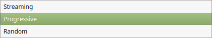  
   Also known as [Segmented file transfer](https://en.wikipedia.org/wiki/Segmented_file_transfer) or swarming. With the following settings the behaviour can be influenced to fit your needs.  
    - **Streaming** causes the transfer to request 1MB file chunks in increasing order, faciliating preview while downloading.
    - **Random** is purely random and favors swarming behaviour at best. 
    - **Progressive** is a compromise, selecting the next chunk at random within less than 50 MB after the end of the partial file. That allows some randomness while preventing large empty file initialization times.  

 - Safety disk space limit  
   RetroShare will suspend all transfers and config file saving if the disk space goes below this limit. That prevents loss of information on some systems. A popup window will warn you when that happens. 
 - Max tunnel req. forwarded per second  
   This value controls how many tunnel requests your peer can forward per second.  
   If you have a large internet bandwidth, you may raise this up to 30-40, to allow statistically longer tunnels to pass. Be very careful though, since this generates many small packets that can significantly slow down your own file transfer.  
   The default value is 20. If you're not sure, keep it that way. 

##Relay  
  

By activating relays, you allow your RetroShare node to act as a bridge 
between RetroShare users who cannot connect directly, e.g. because they're 
firewalled. 

You may choose to act as a relay by checking enable relay connections, or 
simply benefit from other peers acting as a relay, 
by checking *use relay servers*, For the former, you may specify the 
bandwidth allocated when acting as a relay for friends of you, 
for friends of your friends, or anyone in the RetroShare network. 

In any case, a RetroShare node acting as a relay cannot see the relayed 
traffic, since it is encrypted and authenticated by the two relayed nodes.  

###Enable Relay Connections
###Use Relay Servers
###Relay Options

 

##Directories
  

###Shared Directories
 - Edit Share  
     
   a click on *Edit Share* opens the Share Manager  
   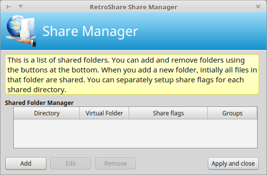  
    - **Add** to create a new shared folder  
    - **Edit** changes permissions or directories of the share  
    - **Remove** removes the shared directory  
    - Share Folder  
    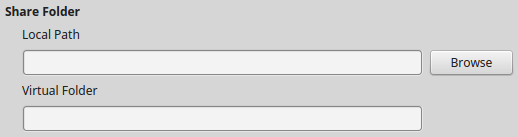  
        - Local Path  
          Set the path in your Operation System File hierarchy
        - Virtual Folder  
          Give the Share a specific name
    - Share Flags  
      By clicking on the Share Flags you can enable or disable them
        - Group Flag OFF  
            
          Browsing disabled for selected groups (Friends, Family, Co-Worker, etc...). 
        - Group Flag ON  
            
          Only direct friend nodes in selected groups can **browse** this directory.  
        - Friend Flag OFF  
            
          Disabled browsing for direct Friends. 
        - Friend Flag ON  
          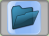  
          All direct friend nodes can browse this directory.  
        - Anonymous Flag OFF  
            
          Directory is not accessible by anonymous tunnels from any Friend. No one can anonymously access this directory.  
        - Anonymous Flag ON  
            
          All friend nodes can relay anonymous tunnels to this directory. Directory is accessible by anonymous tunnels from any friend. 
        - Example Share  
          This directory is not browsable to groups or friends, 
          but it is shared anonymously to anyone who can reach it via anonymous tunnels. 
          Thats the default way to share files anonymously inside the network and make it reachable to Friends of Friends.  
          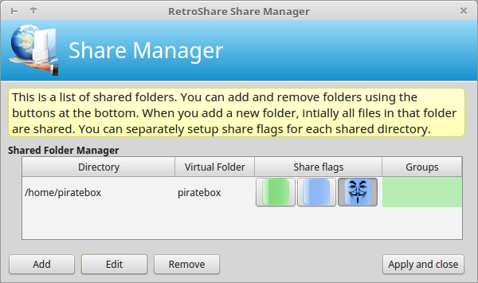  
 - Automatically share incomming directory (Recommended)  
   Downloades are shared while downloading. 
   If the network contains only the initial seeder, 
   other nodes begin to request pieces via the turtle network/anon download. 
   RetroShare nodes incorporate mechanisms to optimize their download and upload rates; 
   for example they download pieces in a random order to increase the opportunity to exchange data, 
   which is only possible if two peers have different pieces of the file. 
   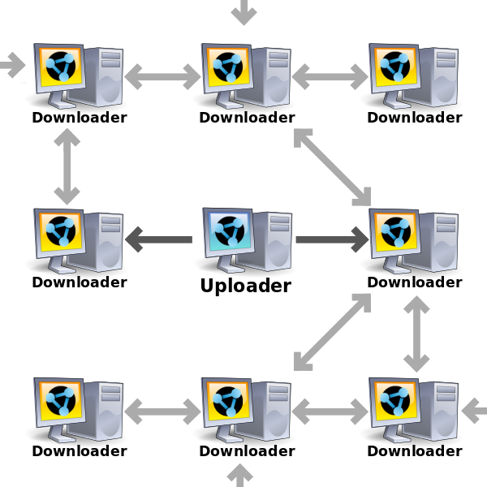   
 - Auto-check shared directories every 10 minutes  
   Shared directories are checked every 10 minutes for changes. New files are hashed and become available for friends. 
 - Incoming Directory  
   The downloads directory where finished downloads are put. 
   It's recommended to share this directory to enable swarming and multi-source download of large files.  
 - Partials Directory  
   Unfinished Files are stored here until they are finished and get moved into the Incoming Directory. 
 

##Plugins

For security reasons, accepted plugins load automatically until the main 
RetroShare executable or the plugin library changes. In such case, the user needs 
to confirm them again. After the program is started, you can enable a 
plugin manually by clicking on the "Enable" button and then restart RetroShare. 

If you want to develop your own plugins, contact the developers team they will 
be happy to help you out!

 - Authorize all plugins 
   Check this for developing plugins. They will not be checked for the 
   hash. However, in normal times, checking the hash protects you from 
   malicious behaviout of crafted plugins.  
 - Plugins  
   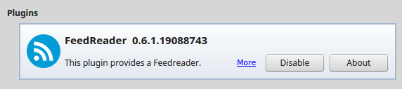  
 - Plugin look-up directories  
   Plugins are loaded from the directories listed in the bottom list.  
   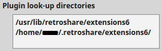  
   
##Notify
  

RetroShare will notify you about what happens in your network. 
Depending on your usage, you may want to enable or disable some of the 
notifications. 

###Feed
###News Feed  
Various events can trigger a notification in your news feed.  

 - Friend Connect
 - Channels
 - Forums
 - Posted 
 - Messages
 - Chat
 - Security
 - Ip security
 - Feed Reader (Plugin)

With the test button, the settings can be tested how they will look like.   
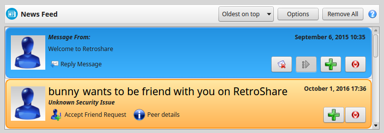  

###Toasters
Various events can trigger a notification in your news feed.  

- Disable All Toasters  
  If the Toasters annoy you, you can disable all at once. 

###Toasters
Various events can trigger a toaster in your news feed.  

 - Friend Connect
 - New Message
 - Download completed
 - Private Chat
 - Group Chat
 - Chat Lobby
 - Connect attempt
 
With the test button, the toaster notification can be tested, 
how it would look like.
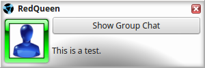  

The Toaster can be place at each corner of the screen.  
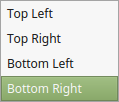  

###Systray
####Systray Icon
There are options to show, combine and blink Systray notifications  

 - Private Chat  
 - Download completed 
 - Chat lobbies 
 - Message  
 - Channel Post  
 - Forum Post  
 - Posted  
 - FeedReader Message(Plugin)

Hovering over the tooltip shows basic information about the notification.  
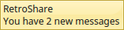  
Clicking on the systray notification shows more details about the notification.  
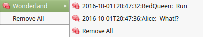  

####Chat Lobbies  
 - Count all unread messages  
 - Count all occurences of my current identity  
 - Count occurences of any of the followign texts (separate by newlines)  
 - case sensitive

##Node
  
###Node Information

####Public Information
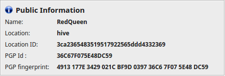

 - Name  
   The Username which you have choosen at creation time of your RetroShare Account
 - Location  
   Each user can have several Location were RetroShare is running. Each device could be having it's 
   own location. For example: Linux Laptop, Windows Gaming PC, Home-Server, Raspberry Pi, Mac, ... and 
   all of these locations can be interconnected and belong to a single user.  
 - Location ID  
   This is the SSLID of the Certificate from the Location
 - PGP Id  
   The Userid is chained to a [PGP](https://en.wikipedia.org/wiki/Pretty_Good_Privacy) certificate.  
   The PGP-ID is the last part of the Fingerprint: **FFFF GGGG HHHH IIII**
 - PGP fingerprint  
   Each PGP Certificate has it's own Fingerprint.  
   PGP Fingerprint are structured like this:  **AAAA BBBB CCCC DDDD EEEE FFFF GGGG HHHH IIII**  
   
####Other information
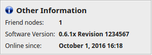

 - Friend nodes  
   How many Friend nodes are connected to your node offline + online
 - Software Version  
   Version + revision of the Software
 - Online since  
   Last time the Location cam online
   
###Certificate
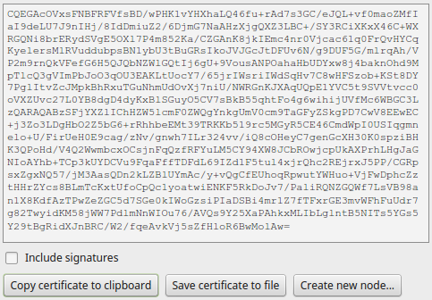  

 - Include signature  
 - Copy certificate to clibboard  
   You can copy this text and send it to your friend via email or some other way. 
 - Save certificate to file  
   Export your certificate to file to send it 
   to your friends so they can import it. 
   The certificate includes your SSLID/Location, IP, Port, DynDNS
 - Create new node...  
   Export your Certificate to create a new location with this User. 

####Show Statistics
  
  
  
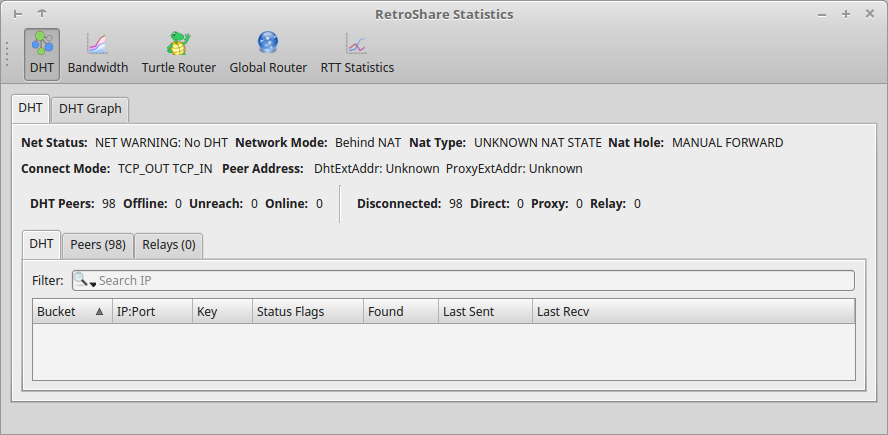  

#####Bandwidth Details
<a href="../../img/settings/statistic/bandwidth_statistic.png" target="_blank">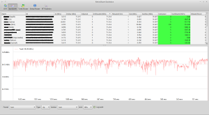</a>  
(click to enlarge)  

#####Turtle Router Details
<a href="../../img/settings/statistic/turtle_router.png" target="_blank">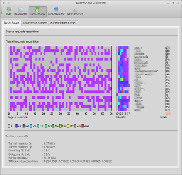</a>  
(click to enlarge)  

#####Global Router Details
  
(click to enlarge)  

#####RTT Details
<a href="../../img/settings/statistic/rtt.png" target="_blank">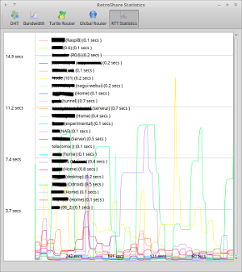</a>  
(click to enlarge) 

###Certificate

##People
  
###Identities handling
 - automatically give "Positive" opinion to my contacts
 - Friend average opinion below which identities are banned: 

##Chat
  
###General
###Distant Chat
###Chat Settings
 - Enable Emoticons Privat Chat
 - Enable Emoticons Group Chat
 - Enable custom fonts
  
 - Minimum font size
 - Enable bold
 - Enable italics
 - Minimum text contrast
 - Send message with Ctrl+Return
###Chat Lobby
 - Blink tab icon
 - Default identity for chat lobbies
###History

###Style

##Message
  
###Distant messages
 - Accept encrypted distant messages from
 
###Reading 
 - Set message to read on activate
 - Load embedded images
 - open messages in

##Channels
  
###General
 - Load posts in background (Thread)
 
###Tabs
 - Open each channel in a new tab
 - Hide tabbar with one open tab

##Forum
  
###Misc
 - Set message to read on activate
 - Expand new messages
 - Load ebedded images
 
###Tabs
 - Open each forum in a new tab
 - Hide tabbar with one open tab

##Posted
  

###Tabs
 - Open each topic in a new tab
 - Hide tabbar with one open tab

##Appearance
  

###Language 
Changes to language will only take effect after restarting RetroShare!

###Style

###Stlye Sheet

###Tool Bar

###Status bar
 - Compact Mode
 - Hide Sound Status
 - Hide Toaster Disabled

##Sound
  

###Chatmessage
 - New Msg
 
###Download

###Friend

##Permissions
  

###Matrix

##Webinterface
  

 - Enable RetroShare WEB Interface
 
###Web parameters

 - Port 9090
 - allow access from all IP adresses (Default: localhost only)

Note: these settings do not affect retroshare-nogui has a command line switch to activate the webinterface

##FeedReader
  
###Network Configuration
